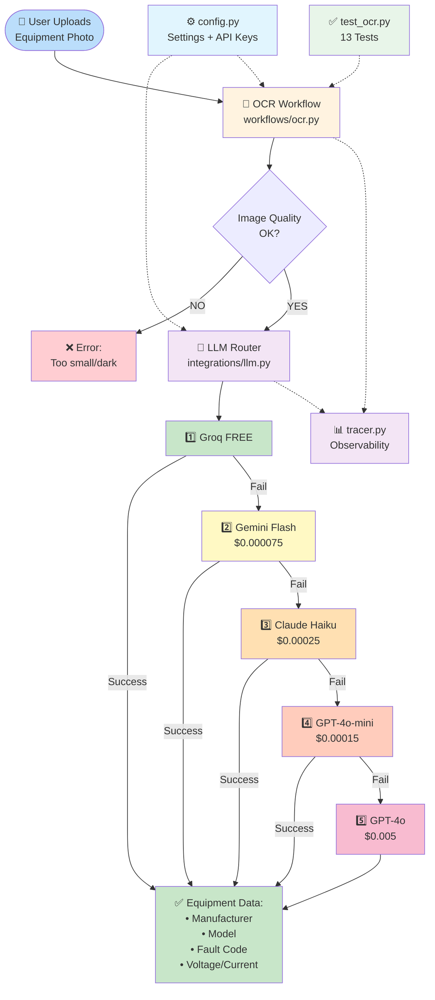
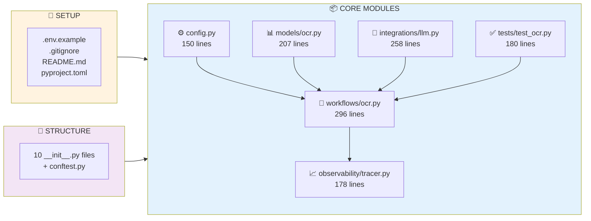
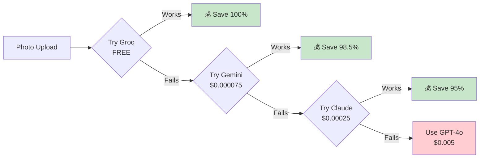

# RIVET Pro 2.0 - System Map

**Simple visual flowchart showing what was built**

---

## Phase 1 Architecture (Commit: fbd397d)

---

## Files Created (20 files, 1,511 lines)

---

## Cost Optimization (73% Savings)

---

## Summary

| Metric | Value |
|--------|-------|
| **Commit** | `fbd397d` |
| **Date** | 2026-01-03 |
| **Files Created** | 20 files |
| **Lines of Code** | 1,511 lines |
| **Status** | ✅ Complete |

**What It Does:**
- 📸 Takes equipment photo → Extracts manufacturer, model, fault codes
- 💰 Tries FREE LLM first → Only pays if needed (73% cost savings)
- ✅ Fully tested → 13 test cases with mocked APIs
- 📊 Observable → Phoenix + LangSmith tracing

**Next:** Phase 2 (4-route orchestrator + 7 vendor SME prompts)
