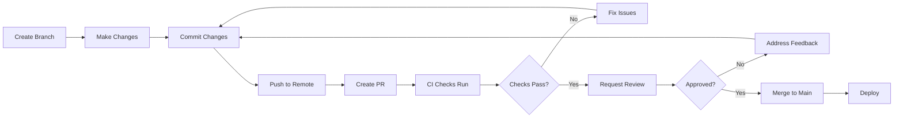

# Branching & Merge Workflow Guide

## Overview

RIVET Pro uses **trunk-based development** with a protected `main` branch and short-lived feature branches. This ensures the main branch is always deployable while allowing safe experimentation in feature branches.

## Main Branch Protection

The `main` branch is protected with the following rules:

- **Required PR reviews**: Minimum 1 approval required (self-approval allowed for solo development)
- **Required status checks**: All CI checks must pass before merge
  - PR Quality Checks (linting, type checking, imports)
  - Ralph Tests (if applicable)
- **No direct pushes**: All changes must go through pull requests

### Emergency Override Procedure

If you need to bypass branch protection in an emergency:

1. **Assess the situation**: Is this truly an emergency that can't wait for a PR?
2. **Document the reason**: Create an issue explaining why the override was necessary
3. **Use admin privileges**: Only repository admins can bypass branch protection
4. **Fix forward**: Create a follow-up PR to properly review the emergency changes
5. **Post-mortem**: Document what happened and how to prevent future emergencies

**Note**: Emergency overrides should be extremely rare. If you find yourself using them frequently, the process needs adjustment.

## Branch Naming Conventions

Use descriptive branch names with the following prefixes:

| Prefix | Purpose | Example |
|--------|---------|---------|
| `ralph/*` | Ralph autonomous agent work | `ralph/manual-matching` |
| `feature/*` | New features or enhancements | `feature/dark-mode` |
| `fix/*` | Bug fixes | `fix/authentication-error` |
| `chore/*` | Maintenance tasks | `chore/update-dependencies` |
| `docs/*` | Documentation updates | `docs/api-reference` |

## Pull Request Workflow

### Standard PR Lifecycle



### Step-by-Step Process

1. **Create a branch from main**
   ```bash
   git checkout main
   git pull origin main
   git checkout -b feature/your-feature-name
   ```

2. **Make your changes**
   - Keep changes focused and atomic
   - Commit frequently with clear messages
   - Follow existing code patterns

3. **Push your branch**
   ```bash
   git push -u origin feature/your-feature-name
   ```

4. **Create a pull request**
   - Go to GitHub and create a PR targeting `main`
   - Fill out the PR template completely
   - Link related issues
   - Document feature flag changes if applicable

5. **Wait for CI checks**
   - PR Quality Checks must pass
   - Fix any linting, type, or test errors
   - Push fixes to the same branch

6. **Request review**
   - Self-review for solo development
   - Request team review for collaborative work
   - Address feedback promptly

7. **Merge to main**
   - Use "Squash and merge" for clean history
   - Delete the feature branch after merge
   - Verify deployment was successful

## Feature Flag Integration

### Decision Tree: Should I Use a Feature Flag?

```
Is this change...

├─ A bug fix or small refactor?
│  └─ NO FLAG NEEDED → Merge directly
│
├─ A new experimental feature?
│  └─ USE FLAG (experiment category)
│
├─ A migration from old to new code?
│  └─ USE FLAG (migration category)
│
├─ A gradual rollout to users?
│  └─ USE FLAG (rollout category)
│
└─ An emergency kill switch?
   └─ USE FLAG (kill_switch category)
```

### When to Use Feature Flags

**Use flags for**:
- Migrating from old to new implementations
- Experimental features that might need quick rollback
- Gradual user rollouts (A/B testing)
- Emergency kill switches for problematic features

**Don't use flags for**:
- Bug fixes (fix the bug directly)
- Simple refactors (if it breaks, fix it)
- Configuration changes (use .env instead)
- Documentation updates

### Working with Feature Flags

1. **Create the flag** in `rivet_pro/config/feature_flags.json`
2. **Wrap your code** with flag checks using `FeatureFlagManager`
3. **Keep both paths** (old and new) until fully rolled out
4. **Document in PR** using the PR template flag section
5. **Test both states** (flag on and flag off)
6. **Remove after 30 days** once fully rolled out

See [docs/FEATURE_FLAGS.md](./FEATURE_FLAGS.md) for detailed flag lifecycle documentation.

## Example: Sample PR Lifecycle

### Scenario: Adding Dark Mode Support

**Step 1: Create branch**
```bash
git checkout -b feature/dark-mode
```

**Step 2: Implement feature behind flag**
```python
# rivet_pro/config/feature_flags.json
{
  "rivet.experiment.dark_mode": {
    "description": "Enable dark mode UI",
    "default_enabled": false,
    "environments": {
      "dev": true,
      "stage": true,
      "prod": false
    }
  }
}

# rivet_pro/ui/theme.py
from rivet_pro.core.feature_flags import FeatureFlagManager

flags = FeatureFlagManager()

def get_theme():
    if flags.is_enabled('rivet.experiment.dark_mode'):
        return load_dark_theme()
    else:
        return load_light_theme()
```

**Step 3: Commit and push**
```bash
git add rivet_pro/config/feature_flags.json rivet_pro/ui/theme.py
git commit -m "feat: Add dark mode support behind feature flag"
git push -u origin feature/dark-mode
```

**Step 4: Create PR**
- Fill out PR template
- Check "This PR affects feature flags"
- Document flag: `rivet.experiment.dark_mode` (Added, default OFF)
- Describe rollout: Dev/Stage ON for testing, Prod OFF initially

**Step 5: CI checks run**
- Type checking passes
- Linting passes
- Tests pass with flag ON and OFF

**Step 6: Review and merge**
- Self-approve (solo dev) or get team approval
- Merge with "Squash and merge"
- Delete branch

**Step 7: Gradual rollout**
- Week 1: Dev/Stage testing
- Week 2: Enable for beta users in prod
- Week 3: Enable for all users
- Week 4: Remove flag and old code path

## Branch Protection Reference

### Current Protection Rules

From `.github/workflows/pr-checks.yml`:
- ✅ Python type checking (mypy)
- ✅ Code linting (ruff)
- ✅ Format checking (black)
- ✅ Import testing

From `.github/workflows/ralph-tests.yml` (for ralph/* branches):
- ✅ Ralph story validation
- ✅ Test suite execution

### Required Checks Before Merge

All PRs to `main` must pass:
1. PR Quality Checks workflow
2. Manual review approval (minimum 1)
3. All conversations resolved
4. Branch up to date with main

## Contributing

For external contributors:

1. **Fork the repository**
2. **Create a feature branch** in your fork
3. **Make your changes** following this guide
4. **Submit a PR** from your fork to our `main`
5. **Wait for review** from maintainers
6. **Address feedback** and push updates
7. **Celebrate** when merged! 🎉

## Questions?

- **Feature flag questions**: See [docs/FEATURE_FLAGS.md](./FEATURE_FLAGS.md)
- **CI failures**: Check workflow logs in GitHub Actions
- **Branch protection issues**: Contact repository admin
- **General questions**: Open a discussion issue
