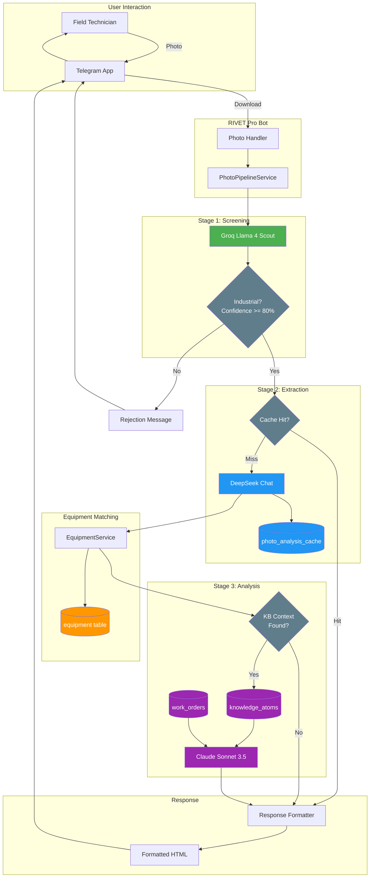

# PRD: Photo Analysis Pipeline

**Document Version**: 1.0
**Last Updated**: 2026-01-17
**Status**: Approved
**Author**: RIVET Pro Engineering

---

## Vision Statement

**Technicians upload equipment photos via Telegram and receive instant AI-powered analysis with troubleshooting guidance.**

Field maintenance technicians work in challenging environments where time is critical. Instead of manually entering equipment data or searching through documentation, they simply snap a photo of an equipment nameplate and receive:
- Automatic equipment identification
- Manufacturer and model extraction
- Relevant troubleshooting solutions
- Safety warnings specific to the equipment
- Links to knowledge base resources

This transforms a manual 10-minute lookup process into a 5-second photo upload.

---

## Core Features

### 1. Photo Ingestion via Telegram

**What it does**: Accept equipment photos from authenticated Telegram users and prepare them for analysis.

**Key Behaviors**:
- Accepts JPEG, PNG, and WEBP images up to 10MB
- Downloads photo from Telegram servers with retry logic
- Validates image dimensions (minimum 480x480 for nameplate readability)
- Computes SHA-256 hash for cache lookup
- Encodes to base64 for AI API transmission

**User Experience**:
```
Technician sends photo → Bot confirms receipt with "🔄 Analyzing..."
```

### 2. Stage 1: Groq Industrial Screening

**What it does**: Fast, cheap first-pass filter to determine if the photo shows industrial equipment.

**AI Model**: `meta-llama/llama-4-scout-17b-16e-instruct` via Groq API
**Cost**: ~$0.001 per image
**Target Latency**: < 2 seconds
**Confidence Threshold**: >= 0.80 to proceed to Stage 2

**Classification Categories**:
- `plc` - Programmable Logic Controllers
- `vfd` - Variable Frequency Drives
- `motor` - Electric Motors
- `pump` - Industrial Pumps
- `control_panel` - Control Panels/Switchgear
- `sensor` - Sensors and Transducers
- `other` - Other industrial equipment

**Rejection Handling**:
- Non-industrial photos receive friendly rejection messages
- Specific messages for food, pets, people, documents, vehicles
- Guidance on what photos to send instead

### 3. Stage 2: DeepSeek Specification Extraction

**What it does**: Detailed extraction of manufacturer, model, serial number, and technical specifications from equipment nameplates.

**AI Model**: `deepseek-chat` via DeepSeek API
**Cost**: ~$0.002 per image
**Target Latency**: < 3 seconds
**Prerequisites**: Stage 1 confidence >= 0.80

**Extracted Fields**:
- Manufacturer name (exact as printed)
- Model/part number (exact as printed)
- Serial number (if visible)
- Technical specifications:
  - Voltage (with unit)
  - Current (with unit)
  - Horsepower
  - RPM
  - Phase (1 or 3)
  - Frequency
  - Frame size
  - NEMA/IP enclosure rating
  - Service factor
  - Efficiency class
  - Insulation class

**Quality Detection**:
- Identifies text quality issues: blurry, partial, faded, dirty, glare
- Automatically reduces confidence score based on issues

### 4. Stage 3: Claude AI Analysis & KB Synthesis

**What it does**: Synthesizes component specs, maintenance history, and knowledge base atoms into actionable troubleshooting guidance.

**AI Model**: `claude-sonnet-4-20250514` via Anthropic API
**Cost**: ~$0.01 per analysis
**Prerequisites**: Equipment matched in database AND KB context found

**Output Includes**:
- Analysis of equipment state and potential issues
- Prioritized list of solutions ordered by likelihood
- Specific actionable recommendations
- Safety warnings (LOTO, PPE, voltage hazards)
- Citations with source URLs from knowledge base

### 5. Photo Analysis Caching

**What it does**: Caches extraction results to avoid re-processing identical photos.

**Implementation**:
- SHA-256 hash of image bytes as cache key
- 24-hour TTL for cached results
- Cache hit tracking (hit_count, last_hit_at)
- Cost savings: Cache hits cost $0.00 vs $0.002+ for fresh analysis

**Database Table**: `photo_analysis_cache`

### 6. CMMS Equipment Integration

**What it does**: Matches or creates equipment records in the CMMS database based on extracted specifications.

**Behaviors**:
- Searches for existing equipment by manufacturer + model
- Creates new equipment record if no match found
- Returns equipment_id, equipment_number, and is_new flag
- Links work orders and maintenance history to equipment

---

## Architecture Diagram



---

## Success Metrics

### Latency Metrics

| Metric | Target | Measurement |
|--------|--------|-------------|
| **End-to-end latency** | < 5 seconds (95th percentile) | Time from photo received to response sent |
| Stage 1 (Groq screening) | < 2 seconds | Groq API call duration |
| Stage 2 (DeepSeek extraction) | < 3 seconds | DeepSeek API call duration |
| Stage 3 (Claude analysis) | < 4 seconds | Claude API call duration |
| Cache hit response | < 500ms | Hash lookup + formatting |

### Accuracy Metrics

| Metric | Target | Measurement |
|--------|--------|-------------|
| **Groq industrial detection accuracy** | > 95% | True positives + true negatives |
| Groq false positive rate | < 3% | Non-industrial passed as industrial |
| Groq false negative rate | < 5% | Industrial rejected as non-industrial |
| DeepSeek manufacturer extraction | > 90% | Correct manufacturer identified |
| DeepSeek model number extraction | > 85% | Correct model number extracted |
| Equipment match rate | > 70% | Photos matched to existing equipment |

### Cost Metrics

| Metric | Target | Measurement |
|--------|--------|-------------|
| **Average cost per photo** | < $0.01 | Total API costs / photos processed |
| Stage 1 (Groq) | ~$0.001 | Fixed per screening |
| Stage 2 (DeepSeek) | ~$0.002 | Only if screening passes |
| Stage 3 (Claude) | ~$0.01 | Only if KB context found |
| Cache hit savings | 30%+ reduction | Photos served from cache |

### Operational Metrics

| Metric | Target | Measurement |
|--------|--------|-------------|
| Pipeline availability | > 99.5% | Successful responses / total requests |
| Rejection rate (non-industrial) | 10-20% expected | Rejected / total photos |
| Error rate | < 1% | Failed analyses / total photos |
| Cache hit rate | > 20% | Cache hits / total extractions |

---

## Acceptance Criteria

### Functional Requirements

1. **Photo Upload**: System accepts photos via Telegram with confirmation message within 1 second
2. **Industrial Detection**: Groq correctly classifies industrial vs non-industrial photos with >= 95% accuracy
3. **Rejection Messages**: Non-industrial photos receive helpful, category-specific rejection messages
4. **Spec Extraction**: DeepSeek extracts manufacturer and model from clear nameplates with >= 85% accuracy
5. **Quality Detection**: System identifies and reports text quality issues (blurry, faded, partial)
6. **Caching**: Identical photos return cached results without re-processing
7. **Equipment Matching**: Extracted specs correctly match or create equipment records
8. **KB Integration**: Stage 3 retrieves and synthesizes relevant knowledge atoms
9. **Safety Warnings**: Response includes appropriate safety warnings for the equipment type
10. **Cost Tracking**: All API costs are logged per stage with Langfuse integration

### Performance Requirements

1. **Latency P95**: 95th percentile end-to-end latency under 5 seconds
2. **Latency P50**: Median end-to-end latency under 3 seconds
3. **Cache Performance**: Cache hits respond in under 500ms
4. **Throughput**: System handles 10 concurrent photo analyses without degradation
5. **Memory**: Pipeline processes photos under 50MB memory overhead

### Reliability Requirements

1. **Graceful Degradation**: If Stage 3 fails, system returns Stage 1+2 results with fallback message
2. **Retry Logic**: Database operations retry with exponential backoff (max 3 attempts)
3. **Error Handling**: All errors logged with trace context and user-friendly error messages returned

---

## Out of Scope

The following features are explicitly **NOT** included in this PRD:

### Not Included (Phase 1)

1. **Google Photos Import** - Batch importing photos from Google Photos albums
2. **Predictive Maintenance** - ML-based prediction of equipment failures
3. **Video Analysis** - Processing video clips of equipment
4. **Multi-Photo Merge** - Combining specs from multiple photos of same equipment
5. **PDF/Manual OCR** - Extracting specs from PDF equipment manuals
6. **Offline Mode** - Analyzing photos without internet connectivity
7. **AR Overlay** - Augmented reality annotations on equipment photos
8. **Voice Commands** - Voice-triggered photo analysis
9. **Scheduled Analysis** - Automated periodic equipment photo analysis
10. **Equipment Comparison** - Side-by-side comparison of multiple equipment

### Future Considerations (Phase 2+)

These may be considered for future phases:

- **Fault Code Database** - Automatic lookup of manufacturer-specific fault codes
- **Parts Identification** - Identifying replacement parts from photos
- **Thermal Imaging** - Integration with thermal camera photos
- **Vibration Analysis** - Integration with vibration sensor data
- **Training Mode** - Learning from technician corrections to improve accuracy

---

## Technical Specifications

### API Dependencies

| Service | API | Rate Limit | Fallback |
|---------|-----|------------|----------|
| Groq | `chat.completions` | 30 req/min | Queue with retry |
| DeepSeek | `chat.completions` | 60 req/min | Skip to Stage 3 |
| Anthropic | `messages` | 60 req/min | Return Stage 2 only |
| Telegram | Bot API | 30 msg/sec | Exponential backoff |

### Database Schema

```sql
-- Photo analysis cache
CREATE TABLE photo_analysis_cache (
    photo_hash VARCHAR(64) PRIMARY KEY,
    manufacturer VARCHAR(255),
    model_number VARCHAR(255),
    serial_number VARCHAR(255),
    specs JSONB,
    raw_text TEXT,
    confidence DECIMAL(3,2),
    model_used VARCHAR(100),
    processing_time_ms INTEGER,
    cost_usd DECIMAL(10,6),
    hit_count INTEGER DEFAULT 0,
    last_hit_at TIMESTAMP,
    created_at TIMESTAMP DEFAULT NOW(),
    expires_at TIMESTAMP DEFAULT NOW() + INTERVAL '24 hours'
);

CREATE INDEX idx_cache_expires ON photo_analysis_cache(expires_at);
```

### Environment Variables

| Variable | Required | Description |
|----------|----------|-------------|
| `GROQ_API_KEY` | Yes | Groq API key for Stage 1 screening |
| `DEEPSEEK_API_KEY` | Yes | DeepSeek API key for Stage 2 extraction |
| `ANTHROPIC_API_KEY` | Yes | Anthropic API key for Stage 3 analysis |
| `DATABASE_URL` | Yes | PostgreSQL connection string |
| `TELEGRAM_BOT_TOKEN` | Yes | Telegram bot authentication |
| `LANGFUSE_PUBLIC_KEY` | No | Langfuse observability (optional) |
| `LANGFUSE_SECRET_KEY` | No | Langfuse observability (optional) |

---

## Risk Assessment

| Risk | Likelihood | Impact | Mitigation |
|------|------------|--------|------------|
| Groq API rate limits | Medium | High | Queue with backoff, cache aggressively |
| DeepSeek model changes | Low | Medium | Version pin, monitor accuracy |
| Low-quality photos | High | Medium | Quality feedback, confidence scoring |
| API cost overruns | Medium | High | Daily cost caps, usage alerts |
| Cache invalidation | Low | Low | 24h TTL, manual purge option |

---

## Stakeholder Approval

| Role | Name | Approved | Date |
|------|------|----------|------|
| Product Owner | | | |
| Engineering Lead | | | |
| QA Lead | | | |

---

## Revision History

| Version | Date | Author | Changes |
|---------|------|--------|---------|
| 1.0 | 2026-01-17 | RIVET Pro Engineering | Initial release |
