# Rivet-PRO Documentation
**Complete System Maps and Guides**

Welcome to the Rivet-PRO documentation! This is your starting point for understanding how the system works.

---

## 🎯 Start Here

**New to Rivet-PRO?** Start with these beginner-friendly guides:

1. [📖 System Overview](./architecture/system_overview.md) - Big picture of how everything works
2. [🌊 Data Flow](./architecture/data_flow.md) - What happens when you send a question
3. [🎲 4-Route Decision Tree](./workflows/troubleshooting_decision_tree.md) - How answers are found

---

## 📚 Documentation Index

### Architecture Guides

#### [System Overview](./architecture/system_overview.md)
**What:** Complete architectural overview with flowcharts
**Covers:** Layers, components, entry points, data models
**Difficulty:** ⭐⭐ Beginner Friendly

#### [Data Flow](./architecture/data_flow.md)
**What:** Request lifecycle from input to response
**Covers:** Photo workflow, text workflow, data transformations
**Difficulty:** ⭐⭐ Beginner Friendly

#### [Component Reference](./architecture/component_reference.md)
**What:** File-by-file breakdown of every Python file
**Covers:** Purpose, functions, dependencies, status
**Difficulty:** ⭐⭐⭐ Intermediate

---

### Workflow Guides

#### [4-Route Decision Tree](./workflows/troubleshooting_decision_tree.md)
**What:** How the system decides which path to take
**Covers:** KB → SME → Research → General fallback
**Difficulty:** ⭐⭐⭐ Intermediate

#### [SME Routing](./workflows/sme_routing.md)
**What:** Equipment expert selection and dispatch
**Covers:** Manufacturer detection, vendor routing, context propagation
**Difficulty:** ⭐⭐⭐ Intermediate

#### [Confidence Scoring](./workflows/confidence_scoring.md)
**What:** How answer quality is measured
**Covers:** Thresholds, OCR scoring, route confidence
**Difficulty:** ⭐⭐ Beginner Friendly

---

### Integration Guides

#### [LLM Provider Chain](./integrations/llm_provider_chain.md)
**What:** AI cost optimization strategy
**Covers:** Provider selection, cost tracking, escalation
**Difficulty:** ⭐⭐ Beginner Friendly

#### [External Dependencies](./integrations/external_dependencies.md)
**What:** All outside services and APIs
**Covers:** Groq, Gemini, Claude, GPT, Telegram, Stripe, observability
**Difficulty:** ⭐⭐ Beginner Friendly

---

### SME Expert Guides

#### [Vendor Specialization Matrix](./sme/vendor_specializations.md)
**What:** What each equipment expert knows
**Covers:** 7 vendor experts + generic, detection keywords, safety focus
**Difficulty:** ⭐⭐ Beginner Friendly

---

### Business Guides

#### [Subscription Tiers](./business/subscription_tiers.md)
**What:** Beta, Pro, and Team plans explained
**Covers:** Pricing, limits, features, ROI calculations
**Difficulty:** ⭐ Beginner Friendly

---

### Project Status

#### [Implementation Status](./project/implementation_status.md)
**What:** What's built, what's coming
**Covers:** Phase breakdown, test coverage, timeline
**Difficulty:** ⭐⭐ Beginner Friendly

---

## 🗺️ Visual Guide Map

### By Topic

```mermaid
graph TB
    START[📖 Start Here] --> ARCH[🏗️ Architecture]
    START --> WORK[⚙️ Workflows]
    START --> INT[🔌 Integrations]

    ARCH --> OVER[System Overview<br/>Big picture]
    ARCH --> FLOW[Data Flow<br/>Request lifecycle]
    ARCH --> COMP[Component Reference<br/>File details]

    WORK --> ROUTE[4-Route Tree<br/>Decision logic]
    WORK --> SME[SME Routing<br/>Expert selection]
    WORK --> CONF[Confidence Scoring<br/>Quality measurement]

    INT --> LLM[LLM Provider Chain<br/>Cost optimization]
    INT --> EXT[External Dependencies<br/>APIs & services]

    START --> EXPERT[👨‍🔧 Experts]
    EXPERT --> VENDOR[Vendor Specialization<br/>What experts know]

    START --> BIZ[💼 Business]
    BIZ --> TIERS[Subscription Tiers<br/>Pricing & plans]

    START --> STATUS[📊 Status]
    STATUS --> IMPL[Implementation Status<br/>What's done]

    style START fill:#4CAF50,color:#fff
    style ARCH fill:#2196F3,color:#fff
    style WORK fill:#FF9800,color:#fff
    style INT fill:#9C27B0,color:#fff
    style EXPERT fill:#F44336,color:#fff
    style BIZ fill:#607D8B,color:#fff
    style STATUS fill:#FFC107
```



---

## 📊 By Difficulty

### ⭐ Beginner (Start Here!)

Perfect for users and new developers:

- [System Overview](./architecture/system_overview.md)
- [Data Flow](./architecture/data_flow.md)
- [Confidence Scoring](./workflows/confidence_scoring.md)
- [LLM Provider Chain](./integrations/llm_provider_chain.md)
- [External Dependencies](./integrations/external_dependencies.md)
- [Vendor Specialization](./sme/vendor_specializations.md)
- [Subscription Tiers](./business/subscription_tiers.md)
- [Implementation Status](./project/implementation_status.md)

### ⭐⭐⭐ Intermediate

For developers building features:

- [Component Reference](./architecture/component_reference.md)
- [4-Route Decision Tree](./workflows/troubleshooting_decision_tree.md)
- [SME Routing](./workflows/sme_routing.md)

---

## 🎯 By User Type

### For End Users

**"How does this work?"**

1. [System Overview](./architecture/system_overview.md) - What Rivet-PRO does
2. [Subscription Tiers](./business/subscription_tiers.md) - Pricing and plans
3. [Vendor Specialization](./sme/vendor_specializations.md) - What experts know

### For New Developers

**"I want to understand the code"**

1. [System Overview](./architecture/system_overview.md) - Architecture
2. [Component Reference](./architecture/component_reference.md) - File guide
3. [Data Flow](./architecture/data_flow.md) - How requests work
4. [Implementation Status](./project/implementation_status.md) - What to work on

### For Technical Decision Makers

**"How does this scale? What's the cost?"**

1. [System Overview](./architecture/system_overview.md) - Architecture
2. [LLM Provider Chain](./integrations/llm_provider_chain.md) - Cost optimization
3. [External Dependencies](./integrations/external_dependencies.md) - Infrastructure
4. [Subscription Tiers](./business/subscription_tiers.md) - Business model
5. [Implementation Status](./project/implementation_status.md) - Roadmap

### For Data Scientists / ML Engineers

**"How does the AI routing work?"**

1. [4-Route Decision Tree](./workflows/troubleshooting_decision_tree.md) - Routing logic
2. [Confidence Scoring](./workflows/confidence_scoring.md) - Quality metrics
3. [LLM Provider Chain](./integrations/llm_provider_chain.md) - Model selection
4. [SME Routing](./workflows/sme_routing.md) - Vendor detection

---

## 🔍 Quick Reference

### Common Questions

| Question | Answer |
|----------|--------|
| **How does photo reading work?** | [Data Flow](./architecture/data_flow.md) → "Path 1: Photo Journey" |
| **What are the 4 routes?** | [4-Route Decision Tree](./workflows/troubleshooting_decision_tree.md) |
| **How much does it cost?** | [Subscription Tiers](./business/subscription_tiers.md) |
| **What AI providers are used?** | [External Dependencies](./integrations/external_dependencies.md) |
| **How is vendor detected?** | [SME Routing](./workflows/sme_routing.md) → "The 3-Step Detection System" |
| **What confidence means?** | [Confidence Scoring](./workflows/confidence_scoring.md) |
| **What's implemented?** | [Implementation Status](./project/implementation_status.md) |
| **What do experts know?** | [Vendor Specialization](./sme/vendor_specializations.md) |

---

## 📁 Directory Structure

```
docs/
├── README.md (You are here!)
├── architecture/
│   ├── system_overview.md
│   ├── data_flow.md
│   └── component_reference.md
├── workflows/
│   ├── troubleshooting_decision_tree.md
│   ├── sme_routing.md
│   └── confidence_scoring.md
├── integrations/
│   ├── llm_provider_chain.md
│   └── external_dependencies.md
├── sme/
│   └── vendor_specializations.md
├── business/
│   └── subscription_tiers.md
└── project/
    └── implementation_status.md
```

---

## 🎨 Document Features

All documentation includes:

- ✅ **Beginner-friendly language** - No jargon without explanation
- ✅ **Visual flowcharts** - Mermaid diagrams for clarity
- ✅ **Real examples** - Concrete use cases
- ✅ **Difficulty ratings** - Know what you're getting into
- ✅ **Cross-references** - Easy navigation
- ✅ **Tables and charts** - Quick reference data

---

## 📖 Reading Paths

### Path 1: "I want the big picture"

```
System Overview → Data Flow → Implementation Status
⏱️ Time: 30 minutes
```

### Path 2: "I want to build features"

```
System Overview → Component Reference → 4-Route Decision Tree → SME Routing
⏱️ Time: 2 hours
```

### Path 3: "I want to understand costs"

```
LLM Provider Chain → External Dependencies → Subscription Tiers
⏱️ Time: 45 minutes
```

### Path 4: "I want to understand the AI"

```
4-Route Decision Tree → Confidence Scoring → SME Routing → Vendor Specialization
⏱️ Time: 1.5 hours
```

---

## 🚀 Getting Started Checklist

**For Users:**
- [ ] Read [System Overview](./architecture/system_overview.md)
- [ ] Check [Subscription Tiers](./business/subscription_tiers.md)
- [ ] Try sending a photo or question!

**For Developers:**
- [ ] Read [System Overview](./architecture/system_overview.md)
- [ ] Review [Component Reference](./architecture/component_reference.md)
- [ ] Check [Implementation Status](./project/implementation_status.md)
- [ ] Set up development environment
- [ ] Run tests: `pytest tests/`

**For Contributors:**
- [ ] Read all architecture docs
- [ ] Understand [4-Route System](./workflows/troubleshooting_decision_tree.md)
- [ ] Review [Implementation Status](./project/implementation_status.md)
- [ ] Pick a TODO from Phase 3-5
- [ ] Submit PR!

---

## 💡 Tips for Reading

### First Time?
Start with [System Overview](./architecture/system_overview.md) - it's designed for beginners!

### Looking for Specifics?
Use the Quick Reference table above or Ctrl+F to search.

### Want Visuals?
Every doc has flowcharts and diagrams. Look for the `mermaid` code blocks.

### Need Help?
- Check `/help` in the Telegram bot
- Review related docs (linked at bottom of each page)
- Ask in the community forum

---

## 📊 Documentation Stats

| Metric | Count |
|--------|-------|
| **Total Documents** | 11 |
| **Total Flowcharts** | 50+ |
| **Total Tables** | 40+ |
| **Total Words** | ~45,000 |
| **Est. Reading Time** | 5-6 hours (all docs) |
| **Difficulty Levels** | Beginner to Intermediate |

---

## 🔄 Last Updated

**Documentation Version:** 1.0
**Last Updated:** 2026-01-03
**Rivet-PRO Version:** Phase 2 Complete
**Next Update:** Phase 3 completion (Q1 2026)

---

## 📞 Feedback

Found something unclear? Have suggestions?

- 📧 Email: docs@rivet-pro.com
- 💬 Telegram: @rivetprosupport
- 🐛 GitHub Issues: [Report Documentation Issues](https://github.com/rivet-pro/rivet/issues)

---

**Happy Reading! 📚**

Remember: Start with the [System Overview](./architecture/system_overview.md) if you're new!
