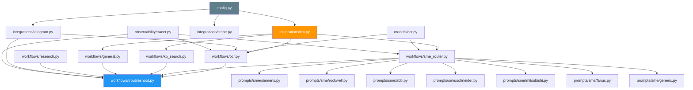

# Component Reference Guide
**Complete File-by-File Breakdown**

---

## What Is This?

This document lists **every Python file** in Rivet-PRO, what it does, and how it fits into the system.

Think of it like a phone directory for code!

---

## Quick Navigation

| Category | Files | What They Do |
|----------|-------|--------------|
| **⚙️ Config** | `config.py` | Settings and API keys |
| **🔌 Integrations** | `llm.py`, `telegram.py`, `stripe.py` | Connect to outside services |
| **🧠 Workflows** | `ocr.py`, `troubleshoot.py`, `sme_router.py`, etc. | Main business logic |
| **👨‍🔧 SME Experts** | `siemens.py`, `rockwell.py`, etc. | Vendor specialists |
| **📦 Models** | `ocr.py` (models folder) | Data structures |
| **📊 Observability** | `tracer.py` | Monitoring and logging |

---

## Configuration Layer

### `rivet/config.py`
**Purpose:** Centralized settings management

| What It Contains | Details |
|------------------|---------|
| **Settings class** | All API keys, database URLs, limits |
| **TierLimits** | Beta/Pro/Team subscription rules |
| **get_settings()** | Singleton function to load settings |
| **Lines of Code** | ~180 |
| **Status** | ✅ Complete |

**Key Functions:**
```python
@lru_cache()
def get_settings() -> Settings:
    # Loads settings from environment variables
    # Cached so only runs once

TierLimits = {
    "beta": {"queries_per_day": 50, ...},
    "pro": {"queries_per_day": 1000, ...},
    "team": {"queries_per_day": -1, ...}  # unlimited
}
```

**Dependencies:**
- `pydantic-settings` - Settings validation
- `python-dotenv` - Load .env files

**Used by:** Everything! All components use settings.

---

## Integration Layer

### `rivet/integrations/llm.py`
**Purpose:** Multi-provider AI router with cost optimization

| Detail | Info |
|--------|------|
| **Main Class** | `LLMRouter` |
| **Key Functions** | `call_vision()`, `generate()` |
| **Providers** | Groq, Gemini, Claude, OpenAI |
| **Lines of Code** | ~412 |
| **Status** | ✅ Complete |

**Key Features:**
- Lazy-loaded AI clients
- Provider chain fallback
- Cost tracking
- Confidence-based escalation

**Key Functions:**
```python
class LLMRouter:
    async def call_vision(provider_config, image_bytes, prompt) -> LLMResponse
    async def generate(prompt, capability=ModelCapability.MODERATE) -> LLMResponse
```

**Dependencies:**
- `groq` - Groq API client
- `google.generativeai` - Gemini client
- `anthropic` - Claude client
- `openai` - GPT client

**Used by:**
- `ocr.py` - Vision calls
- All SME experts - Text generation
- `general.py` - Fallback reasoning

---

### `rivet/integrations/telegram.py`
**Purpose:** Telegram bot interface

| Detail | Info |
|--------|------|
| **Main Handlers** | `/start`, `/help`, photo, text |
| **Key Functions** | `start_handler()`, `photo_handler()`, `text_handler()` |
| **Lines of Code** | ~320 |
| **Status** | 🟡 Partial (Phase 4) |

**Message Handlers:**
- `/start` - Onboarding message
- `/help` - Usage instructions
- `/status` - Usage stats (TODO: DB integration)
- `/tier` - Subscription info
- Photo messages → OCR workflow
- Text messages → Troubleshooting workflow

**Dependencies:**
- `python-telegram-bot` - Telegram Bot API wrapper

**Entry Point:**
```bash
python -m rivet.integrations.telegram
```

---

### `rivet/integrations/stripe.py`
**Purpose:** Payment and subscription management

| Detail | Info |
|--------|------|
| **Main Functions** | `create_subscription()`, `webhook_handler()` |
| **Lines of Code** | ~280 |
| **Status** | 🟡 Stub (Phase 4) |

**Features (Planned):**
- Subscription creation
- Webhook event handling
- Usage limit checking
- Prorated billing

**Dependencies:**
- `stripe` - Stripe API client

**Status:** Skeleton implementation, needs:
- Database integration
- Usage tracking
- Email notifications

---

## Workflow Layer

### `rivet/workflows/ocr.py`
**Purpose:** Equipment photo analysis (OCR)

| Detail | Info |
|--------|------|
| **Main Function** | `analyze_image()` |
| **Provider Chain** | Groq → Gemini → Claude → GPT-4o |
| **Lines of Code** | ~297 |
| **Status** | ✅ Complete |

**What It Does:**
1. Validates image quality
2. Tries free AI first (Groq)
3. Escalates if confidence too low
4. Extracts equipment info
5. Returns OCRResult

**Key Functions:**
```python
async def analyze_image(image_bytes, user_id=None, min_confidence=0.7) -> OCRResult
def validate_image(image_bytes) -> tuple[bool, str]
```

**Returns:** `OCRResult` dataclass with manufacturer, model, fault code, specs, confidence

**Dependencies:**
- `llm.py` - AI provider router
- `models/ocr.py` - OCRResult dataclass
- `PIL` - Image processing

---

### `rivet/workflows/troubleshoot.py`
**Purpose:** 4-route orchestrator - main decision engine

| Detail | Info |
|--------|------|
| **Main Function** | `troubleshoot()` |
| **Routes** | KB → SME → Research → General |
| **Lines of Code** | ~312 |
| **Status** | ✅ Complete |

**What It Does:**
1. Try Route 1: KB search (Phase 3)
2. Try Route 2: Equipment expert
3. Trigger Route 3: Research logging
4. Fallback Route 4: General AI

**Key Functions:**
```python
async def troubleshoot(query, ocr_result=None, min_kb_confidence=0.85, min_sme_confidence=0.70) -> TroubleshootResult
```

**Returns:** `TroubleshootResult` with answer, route, confidence, cost, warnings

**Dependencies:**
- `kb_search.py` - Knowledge base
- `sme_router.py` - Expert routing
- `research.py` - Gap logging
- `general.py` - Fallback

---

### `rivet/workflows/sme_router.py`
**Purpose:** Vendor detection and expert dispatch

| Detail | Info |
|--------|------|
| **Main Functions** | `detect_manufacturer()`, `route_to_sme()` |
| **Vendors Supported** | 7 (Siemens, Rockwell, ABB, Schneider, Mitsubishi, FANUC, Generic) |
| **Lines of Code** | ~342 |
| **Status** | ✅ Complete |

**What It Does:**
1. Detect manufacturer (OCR → query → fault code)
2. Normalize vendor name
3. Dynamically import vendor SME
4. Call expert with context

**Key Functions:**
```python
def detect_manufacturer(query, ocr_result=None) -> str
def normalize_manufacturer(manufacturer) -> str
async def route_to_sme(query, vendor, ocr_result=None) -> dict
```

**Dependencies:**
- All SME expert files (`prompts/sme/*.py`)
- `models/ocr.py` - OCRResult

---

### `rivet/workflows/kb_search.py`
**Purpose:** Vector database knowledge base search

| Detail | Info |
|--------|------|
| **Main Function** | `search_knowledge_base()` |
| **Lines of Code** | ~179 |
| **Status** | 🟡 Stub (Phase 3) |

**Current:** Returns low confidence (0.40) to force SME routing

**Future (Phase 3):**
- pgvector or Pinecone integration
- Semantic search over knowledge atoms
- Synthesize answers from top matches

---

### `rivet/workflows/research.py`
**Purpose:** Knowledge base gap logging and research queue

| Detail | Info |
|--------|------|
| **Main Function** | `trigger_research()` |
| **Lines of Code** | ~219 |
| **Status** | 🟡 Stub (Phase 3) |

**Current:** Logs to console

**Future (Phase 3):**
- Write to Redis queue
- Async research worker
- KB update pipeline

---

### `rivet/workflows/general.py`
**Purpose:** General fallback troubleshooting (Route 4)

| Detail | Info |
|--------|------|
| **Main Function** | `general_troubleshoot()` |
| **AI Used** | Claude Sonnet (COMPLEX capability) |
| **Lines of Code** | ~229 |
| **Status** | ✅ Complete |

**What It Does:**
- Best-effort answer when KB and SME fail
- Uses Claude with general industrial knowledge
- Extracts safety warnings
- Always returns (never fails)

**Key Functions:**
```python
async def general_troubleshoot(query, ocr_result=None) -> dict
```

---

## SME Expert Layer

All SME files follow the same pattern:

| File | Expert | Knowledge | Lines | Status |
|------|--------|-----------|-------|--------|
| `prompts/sme/siemens.py` | Siemens | S7 PLCs, TIA Portal, PROFINET | ~188 | ✅ Complete |
| `prompts/sme/rockwell.py` | Rockwell | ControlLogix, Studio 5000, EtherNet/IP | ~190 | ✅ Complete |
| `prompts/sme/abb.py` | ABB | ACS drives, Robots, RobotStudio | ~185 | ✅ Complete |
| `prompts/sme/schneider.py` | Schneider | Modicon PLCs, Altivar VFDs, Unity Pro | ~192 | ✅ Complete |
| `prompts/sme/mitsubishi.py` | Mitsubishi | MELSEC PLCs, GX Works, CC-Link | ~187 | ✅ Complete |
| `prompts/sme/fanuc.py` | FANUC | CNC systems, Robots, G-code | ~189 | ✅ Complete |
| `prompts/sme/generic.py` | Generic | Motors, Relays, Electrical basics | ~175 | ✅ Complete |

**Common Pattern:**
```python
# Each SME file contains:
VENDOR_SME_PROMPT = """..."""  # Vendor-specific expertise

def format_vendor_context(ocr_result) -> str:
    # Format equipment context

@traced(name="vendor_sme", tags=["sme", "vendor"])
async def troubleshoot(query, ocr_result=None) -> dict:
    # Call LLM with vendor-specific prompt
    # Extract safety warnings
    # Return structured response
```

**All return:**
```python
{
    "answer": str,
    "confidence": float,  # 0.80 for vendor-specific, 0.72 for generic
    "safety_warnings": list,
    "llm_calls": int,
    "cost_usd": float
}
```

---

## Data Model Layer

### `rivet/models/ocr.py`
**Purpose:** OCR result data structure

| Detail | Info |
|--------|------|
| **Main Class** | `OCRResult` (dataclass) |
| **Lines of Code** | ~142 |
| **Status** | ✅ Complete |

**Fields:**
```python
@dataclass
class OCRResult:
    manufacturer: str
    model_number: str
    serial_number: str
    fault_code: str
    equipment_type: str  # vfd, motor, plc, etc.
    equipment_subtype: str
    condition: str  # new, good, worn, damaged, burnt
    visible_issues: List[str]
    voltage, current, horsepower, phase, frequency
    additional_specs: Dict
    raw_text: str
    confidence: float  # 0.0-1.0
    provider: str
    model_used: str
    processing_time_ms: int
    cost_usd: float

    # Helper methods
    def normalize() -> None
    def is_successful() -> bool
    def has_equipment_id() -> bool
```

**Used by:**
- `ocr.py` - Creates instances
- `troubleshoot.py` - Receives equipment context
- `sme_router.py` - Detects manufacturer

---

## Observability Layer

### `rivet/observability/tracer.py`
**Purpose:** Tracing and logging setup

| Detail | Info |
|--------|------|
| **Main Function** | `traced()` decorator |
| **Backends** | Phoenix AI, LangSmith |
| **Lines of Code** | ~95 |
| **Status** | ✅ Complete |

**What It Provides:**
- `@traced` decorator for functions
- Automatic trace logging
- Cost and performance tracking
- Metadata attachment

**Usage:**
```python
@traced(name="workflow_name", tags=["tag1", "tag2"])
async def my_workflow():
    # Automatically traced
    pass
```

**Dependencies:**
- `arize-phoenix` (optional)
- `langsmith` (optional)

---

## Test Files

### `tests/test_ocr.py`
- **Tests:** 13 test cases
- **Coverage:** OCR workflow, provider chain, confidence calculation
- **Status:** ✅ All passing

### `tests/test_routing.py`
- **Tests:** 6 test cases
- **Coverage:** Manufacturer detection, vendor routing
- **Status:** ✅ All passing

### `tests/test_troubleshoot.py`
- **Tests:** 8 test cases
- **Coverage:** 4-route system, route selection
- **Status:** ✅ All passing

---

## Dependency Graph



---

## File Status Summary

| Phase | Files | Status | Notes |
|-------|-------|--------|-------|
| **Phase 1** | `ocr.py`, `llm.py`, `models/ocr.py` | ✅ Complete | 13 tests passing |
| **Phase 2** | `troubleshoot.py`, `sme_router.py`, all SMEs | ✅ Complete | 14 tests passing |
| **Phase 3** | `kb_search.py`, `research.py` | 🟡 Stub | Mocked for testing |
| **Phase 4** | `telegram.py`, `stripe.py` | 🟡 Partial | Core handlers working |
| **Phase 5** | Database layer, rate limiting | ❌ Not started | Design phase |
| **Infrastructure** | `config.py`, `tracer.py` | ✅ Complete | Fully functional |

---

## Lines of Code by Category

| Category | Files | Total LOC | Avg per File |
|----------|-------|-----------|--------------|
| **Config** | 1 | ~180 | 180 |
| **Integrations** | 3 | ~1,012 | 337 |
| **Workflows** | 6 | ~1,573 | 262 |
| **SME Experts** | 7 | ~1,306 | 187 |
| **Models** | 1 | ~142 | 142 |
| **Observability** | 1 | ~95 | 95 |
| **Tests** | 3 | ~670 | 223 |
| **TOTAL** | **22** | **~4,978** | **226** |

---

## Entry Points

### Production
```bash
# Telegram bot (main user interface)
python -m rivet.integrations.telegram
```

### Development/Testing
```python
# Direct imports
from rivet.workflows.ocr import analyze_image
from rivet.workflows.troubleshoot import troubleshoot

# Run tests
pytest tests/
```

---

## Key Takeaways

### For New Developers:
- **Start here:** `config.py` → `llm.py` → `troubleshoot.py`
- **Understand flows:** Read `troubleshoot.py` to see how routes work
- **Find files fast:** Use this reference table!

### File Naming Conventions:
- `rivet/integrations/` - External services
- `rivet/workflows/` - Business logic
- `rivet/prompts/sme/` - Vendor experts
- `rivet/models/` - Data structures
- `rivet/observability/` - Monitoring

---

## Related Docs

- [System Overview](./system_overview.md) - How components fit together
- [Data Flow](./data_flow.md) - Request lifecycle
- [SME Experts Guide](../sme/vendor_specializations.md) - Expert details

---

**Last Updated:** 2026-01-03
**Difficulty:** ⭐⭐⭐ Intermediate
