# How Data Flows Through Rivet-PRO
**A Visual Guide to What Happens When You Send a Question**

---

## Overview

This document shows **step-by-step** what happens to your photo or question from the moment you send it until you get an answer back.

---

## The Two Main Paths

Rivet-PRO handles two types of requests:

```mermaid
graph LR
    YOU[👤 You] --> CHOICE{What do you send?}

    CHOICE -->|📸 Photo| PATH1[Photo Path<br/>Read equipment<br/>then troubleshoot]
    CHOICE -->|💬 Text Question| PATH2[Text Path<br/>Just troubleshoot]

    PATH1 --> RESULT[Answer with<br/>troubleshooting steps]
    PATH2 --> RESULT

    style YOU fill:#4CAF50,color:#fff
    style CHOICE fill:#2196F3,color:#fff
    style PATH1 fill:#FF9800,color:#fff
    style PATH2 fill:#9C27B0,color:#fff
    style RESULT fill:#66BB6A,color:#fff
```



---

## Path 1: Photo Journey (Complete Flow)

### What Happens When You Send a Photo

```mermaid
sequenceDiagram
    autonumber
    participant You as 👤 You
    participant TG as 📱 Telegram Bot
    participant OCR as 📸 Photo Reader
    participant AI1 as 🤖 Groq AI<br/>(Free)
    participant Router as 🎯 Router
    participant SME as 👨‍🔧 Expert
    participant AI2 as 🤖 AI Model

    Note over You,AI2: PHASE 1: Photo Upload & Reading

    You->>TG: Send equipment photo<br/>"Motor won't start"
    TG->>TG: Download photo<br/>Check if it's clear enough
    TG->>OCR: Here's a photo to read

    Note over OCR: Try cheapest AI first

    OCR->>AI1: Read this nameplate photo
    AI1-->>OCR: Results:<br/>Brand: Siemens<br/>Model: S7-1200<br/>Fault: F-0002<br/>Confidence: 85%

    Note over OCR: Cost: $0.00 (free!)<br/>Time: 0.8 seconds

    Note over You,AI2: PHASE 2: Smart Routing

    OCR->>Router: Equipment info package:<br/>• Brand: Siemens<br/>• Model: S7-1200<br/>• Fault Code: F-0002<br/>• Your question: "Motor won't start"

    Router->>Router: Check Path 1: Knowledge Base<br/>❌ Not found (Phase 3)

    Router->>Router: Check Path 2: Equipment Expert<br/>✅ Detected: Siemens!<br/>Route to Siemens specialist

    Note over You,AI2: PHASE 3: Expert Analysis

    Router->>SME: Siemens expert,<br/>analyze this problem

    SME->>SME: Build specialized prompt:<br/>• Equipment context<br/>• Siemens-specific knowledge<br/>• Safety warnings

    SME->>AI2: Expert prompt +<br/>equipment details
    AI2-->>SME: F-0002 = PROFINET timeout<br/>Detailed troubleshooting steps<br/>Safety warnings

    Note over SME: Cost: $0.002<br/>Time: 0.4 seconds<br/>Confidence: 80%

    Note over You,AI2: PHASE 4: Response Formatting

    SME->>Router: Answer package:<br/>• Troubleshooting steps<br/>• Safety warnings<br/>• Confidence: 80%<br/>• Cost: $0.002

    Router->>Router: Add metadata:<br/>• Route taken: SME<br/>• Expert used: Siemens<br/>• Total time: 1.2s<br/>• Total cost: $0.002

    Router->>TG: Final formatted response
    TG->>You: ✅ Troubleshooting Steps<br/>⚠️ LOTO Required, 480V<br/>📊 Confidence: 80%<br/>👨‍🔧 Siemens Expert

    Note over You,AI2: Total Journey: 1.2 seconds, $0.002
```



### Step-by-Step Breakdown

| Step | What Happens | Who Does It | Time | Cost |
|------|-------------|-------------|------|------|
| 1 | You take photo of equipment | You | - | - |
| 2 | Telegram bot receives photo | Telegram Bot | 0.1s | Free |
| 3 | Bot downloads and validates image | Telegram Bot | 0.1s | Free |
| 4 | Photo sent to OCR workflow | Photo Reader | - | - |
| 5 | OCR tries free AI first (Groq) | Photo Reader | 0.8s | $0.00 |
| 6 | AI reads nameplate text | Groq AI | - | - |
| 7 | Equipment info extracted | Photo Reader | 0.1s | - |
| 8 | Router receives equipment data | Router | - | - |
| 9 | Router tries Path 1 (KB) - fails | Router | 0.05s | - |
| 10 | Router detects brand → Siemens | Router | 0.05s | - |
| 11 | Routes to Siemens expert | Router | - | - |
| 12 | Expert builds specialized prompt | Siemens SME | 0.05s | - |
| 13 | Expert calls AI for answer | Siemens SME | 0.4s | $0.002 |
| 14 | AI returns troubleshooting steps | AI Model | - | - |
| 15 | Expert extracts safety warnings | Siemens SME | 0.05s | - |
| 16 | Router packages final response | Router | 0.05s | - |
| 17 | Telegram sends you the answer | Telegram Bot | 0.1s | - |
| **TOTAL** | **End-to-end** | - | **~1.2s** | **$0.002** |

---

## Path 2: Text Question Journey

### What Happens When You Send a Text Question (No Photo)

```mermaid
sequenceDiagram
    autonumber
    participant You as 👤 You
    participant TG as 📱 Telegram
    participant Router as 🎯 Router
    participant KB as 📚 Knowledge Base<br/>(Phase 3)
    participant SME as 👨‍🔧 Expert
    participant AI as 🤖 AI Model
    participant Research as 🔬 Research Logger

    You->>TG: Text question:<br/>"Why is my VFD showing E03?"

    TG->>Router: Question received

    Note over Router,KB: TRY PATH 1: Knowledge Base

    Router->>KB: Search for "VFD E03"
    KB-->>Router: ❌ Not found<br/>(Phase 3 - coming soon)

    Note over Router: Confidence: 40%<br/>Below 85% threshold<br/>Continue to Path 2

    Note over Router,SME: TRY PATH 2: Equipment Expert

    Router->>Router: Detect manufacturer<br/>from question text

    Router->>Router: ❌ No brand mentioned<br/>Use Generic Expert

    Router->>SME: Generic expert,<br/>analyze VFD error E03

    SME->>AI: What causes E03 on VFD?
    AI-->>SME: E03 = Overcurrent fault<br/>Check motor, wiring, load

    Note over SME: Confidence: 72%<br/>✅ Meets 70% threshold

    SME->>Router: Answer ready!

    Note over Router: Skip Path 3 & 4<br/>We have good answer

    Router->>TG: Formatted response
    TG->>You: ✅ Troubleshooting steps<br/>📊 Confidence: 72%<br/>👨‍🔧 Generic Expert

    Note over You,AI: Total time: 0.6 seconds<br/>Total cost: $0.001
```



### What if the Expert Isn't Confident?

If the expert's confidence is too low (<70%), the system continues:


---

## Data Transformations

### How Data Changes Shape Through The System

```mermaid
graph LR
    A[📸 Raw Image<br/>Binary bytes] --> B[📋 OCR Result<br/>Equipment Info]

    B --> C[🎯 Routing Context<br/>Question + Equipment]

    C --> D[💬 Expert Answer<br/>Troubleshooting Steps]

    D --> E[📦 Final Package<br/>Answer + Metadata]

    E --> F[📱 User Response<br/>Formatted Text]

    style A fill:#F44336,color:#fff
    style B fill:#FF9800,color:#fff
    style C fill:#FFC107
    style D fill:#66BB6A,color:#fff
    style E fill:#2196F3,color:#fff
    style F fill:#4CAF50,color:#fff
```



Let's see what each transformation looks like:

#### 1. Raw Image → OCR Result

**Before:**
```
Binary image data: 2.3 MB JPEG file
```

**After:**
```json
{
  "manufacturer": "siemens",
  "model_number": "S7-1200",
  "fault_code": "F-0002",
  "voltage": "24V DC",
  "equipment_type": "plc",
  "confidence": 0.85,
  "cost_usd": 0.00
}
```

#### 2. OCR Result → Routing Context

**Before:**
```json
{
  "manufacturer": "siemens",
  "model_number": "S7-1200",
  "fault_code": "F-0002"
}
```

**After:**
```
Query: "Motor won't start"
Equipment Context:
  - Manufacturer: Siemens
  - Model: S7-1200 PLC
  - Fault Code: F-0002 (PROFINET communication)
  - Equipment Type: Programmable Logic Controller
```

#### 3. Routing Context → Expert Answer

**Before:**
```
Question: Motor won't start
Equipment: Siemens S7-1200, F-0002
```

**After:**
```
TROUBLESHOOTING STEPS:

F-0002 indicates a PROFINET communication timeout on your
Siemens S7-1200 PLC. This means the PLC cannot communicate
with a connected device.

1. CHECK PROFINET CABLE: Verify cable is securely connected
   and not damaged. Look for bent pins or cuts.

2. VERIFY DEVICE ADDRESS: Ensure the remote device has the
   correct IP address configured in TIA Portal.

3. CHECK NETWORK SWITCH: Confirm industrial switch is powered
   and functioning. Check link lights.

4. REVIEW TOPOLOGY: In TIA Portal, verify PROFINET topology
   matches physical wiring.

⚠️ SAFETY: De-energize before checking connections (LOTO).
⚠️ HIGH VOLTAGE: This is a 480V 3-phase system.

Confidence: 80%
Expert: Siemens Specialist
```

#### 4. Expert Answer → Final Package

**Before:**
```
Answer text + safety warnings
```

**After:**
```json
{
  "answer": "F-0002 indicates...",
  "route": "sme",
  "confidence": 0.80,
  "manufacturer": "siemens",
  "sme_vendor": "siemens",
  "safety_warnings": [
    "⚠️ LOTO REQUIRED",
    "⚠️ HIGH VOLTAGE - 480V system"
  ],
  "processing_time_ms": 1200,
  "llm_calls": 2,
  "cost_usd": 0.002,
  "sources": []
}
```

#### 5. Final Package → User Response

**Before:**
```json
{
  "answer": "...",
  "confidence": 0.80,
  "sme_vendor": "siemens"
}
```

**After (Telegram formatting):**
```
✅ TROUBLESHOOTING STEPS

F-0002 indicates a PROFINET communication timeout...

⚠️ SAFETY WARNINGS:
• LOTO REQUIRED - De-energize before servicing
• HIGH VOLTAGE - 480V 3-phase system

━━━━━━━━━━━━━━━━━━
📊 Confidence: 80%
👨‍🔧 Expert: Siemens Specialist
⏱️ Processed in 1.2s
```

---

## Cost Accumulation Flow

### How Costs Add Up Across The System


**Cost Breakdown Example:**
- **OCR (Groq)**: $0.00 (free tier)
- **Siemens Expert (Moderate AI)**: $0.002
- **Total**: $0.002 per question

If it had escalated through all AIs:
- Groq: $0.00
- Gemini: $0.0001
- Claude: $0.0005
- Total: $0.0006 (only charged for what was actually used)

---

## Processing Time Breakdown


**Average Times:**
- **Photo download**: 100ms
- **OCR processing**: 800ms
- **Brand detection**: 50ms
- **Expert analysis**: 400ms
- **Response formatting**: 100ms
- **Total**: ~1,450ms (1.45 seconds)

---

## Error Handling Flow

### What Happens When Things Go Wrong

```mermaid
graph TD
    START[Request Arrives] --> VAL{Valid Input?}

    VAL -->|❌ Invalid photo| ERR1[Error: Please send<br/>a clear photo]
    VAL -->|❌ Empty message| ERR2[Error: Please include<br/>a question]
    VAL -->|✅ Valid| PROC[Process Request]

    PROC --> OCR{OCR Success?}

    OCR -->|❌ All AIs failed| CONT1[Continue without<br/>equipment info]
    OCR -->|✅ Success| CONT1

    CONT1 --> ROUTE[4-Route System]

    ROUTE --> PATH1{Path 1 OK?}
    PATH1 -->|❌ Failed| PATH2{Path 2 OK?}
    PATH1 -->|✅ Success| DONE

    PATH2 -->|❌ Failed| PATH3{Path 3 OK?}
    PATH2 -->|✅ Success| DONE

    PATH3 -->|❌ Failed| PATH4[Path 4: Always Works]
    PATH3 -->|Logged| PATH4

    PATH4 --> DONE[✅ User Gets Answer]

    ERR1 & ERR2 --> USER[Return Error to User]

    style ERR1 fill:#F44336,color:#fff
    style ERR2 fill:#F44336,color:#fff
    style DONE fill:#66BB6A,color:#fff
    style PATH4 fill:#4CAF50,color:#fff
```



**Key Point:** The system is designed so you **ALWAYS get an answer**, even if:
- OCR fails to read the photo
- No vendor is detected
- Expert isn't confident
- Knowledge base is empty

Path 4 (General Fallback) guarantees a response!

---

## Metadata Flow

### What Information Gets Logged

```mermaid
graph LR
    A[Request] --> B[Logged Info]

    B --> C[📊 Performance<br/>• Processing time<br/>• LLM calls count<br/>• Total cost<br/>• Provider used]

    B --> D[🎯 Routing<br/>• Which path taken<br/>• Confidence scores<br/>• KB/SME/General<br/>• Vendor detected]

    B --> E[⚙️ Technical<br/>• Equipment brand<br/>• Model number<br/>• Fault code<br/>• OCR confidence]

    B --> F[⚠️ Safety<br/>• Warnings extracted<br/>• Voltage levels<br/>• LOTO requirements]

    C & D & E & F --> G[Observability<br/>Dashboard]

    style A fill:#4CAF50,color:#fff
    style B fill:#2196F3,color:#fff
    style G fill:#FF9800,color:#fff
```



This helps developers:
- Debug issues
- Improve accuracy
- Optimize costs
- Add new knowledge

---

## Complete End-to-End Flow Chart

```mermaid
flowchart TD
    START([👤 User Sends<br/>Photo + Question]) --> TG[📱 Telegram Bot]

    TG --> CHECK{What type?}

    CHECK -->|Photo| DL[Download Image]
    CHECK -->|Text Only| ROUTE

    DL --> OCR[📸 OCR Workflow]
    OCR --> TRY1{Try Groq<br/>Free AI}

    TRY1 -->|✅ Good| EXTRACTED[Equipment Info<br/>Extracted]
    TRY1 -->|❌ Low confidence| TRY2{Try Gemini<br/>Costs $}

    TRY2 -->|✅ Good| EXTRACTED
    TRY2 -->|❌ Still low| TRY3{Try Claude<br/>Costs $$}

    TRY3 -->|✅ Good| EXTRACTED
    TRY3 -->|❌ Hard to read| TRY4[Try GPT-4<br/>Costs $$$]

    TRY4 --> EXTRACTED

    EXTRACTED --> ROUTE[🎯 Router]

    ROUTE --> P1{Path 1:<br/>Knowledge Base}
    P1 -->|✅ Found<br/>Confidence ≥85%| ANSWER
    P1 -->|❌ Not found| P2

    P2{Path 2:<br/>Equipment Expert}
    P2 --> DETECT{Detect<br/>Brand}

    DETECT -->|Siemens| E1[Siemens SME]
    DETECT -->|Rockwell| E2[Rockwell SME]
    DETECT -->|ABB| E3[ABB SME]
    DETECT -->|Schneider| E4[Schneider SME]
    DETECT -->|Mitsubishi| E5[Mitsubishi SME]
    DETECT -->|FANUC| E6[FANUC SME]
    DETECT -->|Unknown| E7[Generic SME]

    E1 & E2 & E3 & E4 & E5 & E6 & E7 --> CONF{Confidence<br/>≥70%?}

    CONF -->|✅ Yes| ANSWER
    CONF -->|❌ No| P3[Path 3:<br/>Log for Research]

    P3 --> P4[Path 4:<br/>General AI<br/>Always Works]

    P4 --> ANSWER[📦 Package Response]

    ANSWER --> FORMAT[Format with:<br/>• Troubleshooting steps<br/>• Safety warnings<br/>• Confidence score<br/>• Metadata]

    FORMAT --> SEND[📱 Send to User]

    SEND --> DONE([✅ User Receives<br/>Answer])

    style START fill:#4CAF50,color:#fff
    style EXTRACTED fill:#FF9800,color:#fff
    style ANSWER fill:#66BB6A,color:#fff
    style DONE fill:#4CAF50,color:#fff
    style P1 fill:#2196F3,color:#fff
    style P2 fill:#2196F3,color:#fff
    style P3 fill:#9C27B0,color:#fff
    style P4 fill:#F44336,color:#fff
```



---

## Key Takeaways

### Speed
- Average response: **1-2 seconds**
- OCR is the slowest part (AI vision processing)
- Text-only questions are faster

### Cost
- Average cost: **$0.001 - $0.003 per question**
- Photos cost slightly more (OCR processing)
- System tries free AI first to save money

### Reliability
- **4-path system** ensures you always get an answer
- Even if OCR fails, system continues
- Path 4 (General Fallback) never fails

### Metadata
Everything is logged for:
- Cost tracking (billing)
- Performance monitoring
- Debugging issues
- Improving the system

---

## Related Docs

- [System Overview](./system_overview.md) - Big picture architecture
- [4-Route Decision Tree](../workflows/troubleshooting_decision_tree.md) - Routing logic details
- [Cost Optimization](../integrations/llm_provider_chain.md) - How AI costs are minimized

---

**Last Updated**: 2026-01-03
**Difficulty**: ⭐⭐ Beginner Friendly
