# Rivet-PRO System Architecture Overview
**A Beginner's Guide to How the System Works**

---

## What Does Rivet-PRO Do?

Rivet-PRO is like having an expert industrial electrician in your pocket. You:
1. Take a photo of broken equipment
2. Send it via Telegram
3. Get step-by-step troubleshooting help

The system can also answer text questions like "Why is my motor overheating?"

---

## How It Works (Simple Version)

```mermaid
graph LR
    A[📱 You take photo<br/>of equipment] --> B[🤖 Bot reads<br/>nameplate]
    B --> C[🔍 System figures out<br/>what's broken]
    C --> D[👨‍🔧 Expert answer<br/>sent back to you]

    style A fill:#e1f5ff
    style B fill:#fff4e1
    style C fill:#ffe1e1
    style D fill:#e1ffe1
```

That's it! But under the hood, there's a lot more happening...

---

## The System in 4 Simple Layers

Think of Rivet-PRO like a building with 4 floors:

### Floor 4: What You See
This is just your Telegram app. You send photos or questions, and get answers back.

### Floor 3: The Brain
This is where the magic happens:
- **Photo Reader (OCR)**: Reads equipment nameplates like a human would
- **Question Router**: Decides which expert should answer your question
- **Answer Generator**: Puts together the final troubleshooting steps

### Floor 2: The Helpers
These are the specialists:
- **AI Models**: Different AI companies (Groq is free, others cost money)
- **Knowledge Base**: Pre-written answers to common problems (coming soon!)
- **7 Equipment Experts**: Specialists for Siemens, Rockwell, ABB, etc.

### Floor 1: The Foundation
The behind-the-scenes stuff:
- **Settings**: Which AI to use, API keys, user limits
- **Cost Tracker**: Keeps track of how much each question costs
- **Activity Logger**: Records what happens for debugging

---

## The Complete System Map

```mermaid
graph TB
    subgraph USER["👤 USER INTERACTION"]
        U1[Field Technician]
        U2[📱 Telegram App]
    end

    subgraph ENTRY["🚪 ENTRY POINTS"]
        TG[Telegram Bot<br/>Receives messages]
    end

    subgraph BRAIN["🧠 THE BRAIN - Main Workflows"]
        OCR["📸 Photo Reader OCR<br/>━━━━━━━━━━<br/>What: Reads equipment nameplates<br/>Input: Photo<br/>Output: Equipment info"]

        ROUTE["🎯 Smart Router<br/>━━━━━━━━━━<br/>Decides who should answer<br/>4 possible paths"]
    end

    subgraph PATHS["🛤️ THE 4 PATHS - How Answers Are Found"]
        PATH1["Path 1: 📚 Knowledge Base<br/>━━━━━━━━━━<br/>Pre-written answers<br/>Confidence needed: 85%<br/>Status: Coming in Phase 3"]

        PATH2["Path 2: 👨‍🔧 Equipment Expert<br/>━━━━━━━━━━<br/>Vendor-specific specialist<br/>Confidence needed: 70%<br/>Status: ACTIVE"]

        PATH3["Path 3: 🔬 Research Logger<br/>━━━━━━━━━━<br/>Logs question for later research<br/>Non-blocking<br/>Status: Coming in Phase 3"]

        PATH4["Path 4: 🤖 General AI<br/>━━━━━━━━━━<br/>Claude AI best guess<br/>Always works as backup<br/>Status: ACTIVE"]
    end

    subgraph EXPERTS["👷 THE EXPERTS - Vendor Specialists"]
        EX1[Siemens<br/>S7 PLCs]
        EX2[Rockwell<br/>ControlLogix]
        EX3[ABB<br/>Drives/Robots]
        EX4[Schneider<br/>Modicon PLCs]
        EX5[Mitsubishi<br/>MELSEC]
        EX6[FANUC<br/>CNC/Robots]
        EX7[Generic<br/>Everything Else]
    end

    subgraph AI["🤖 AI PROVIDERS - The Models"]
        AI1["Groq<br/>FREE<br/>Tries First"]
        AI2["Gemini<br/>$<br/>Backup"]
        AI3["Claude<br/>$$<br/>Backup"]
        AI4["GPT-4<br/>$$$<br/>Last Resort"]
    end

    subgraph INFRA["⚙️ FOUNDATION"]
        CFG[Settings<br/>API Keys & Limits]
        COST[Cost Tracker<br/>Monitors spending]
        LOG[Activity Logger<br/>Phoenix & LangSmith]
    end

    %% Flow
    U1 --> U2
    U2 --> TG

    TG -->|Photo| OCR
    TG -->|Question| ROUTE
    OCR -->|Equipment Info| ROUTE

    ROUTE -->|Try First| PATH1
    PATH1 -.->|If Not Found| PATH2
    PATH2 -->|Picks Expert| EXPERTS
    PATH2 -.->|If Uncertain| PATH3
    PATH3 --> PATH4

    EXPERTS --> AI1
    EXPERTS --> AI2
    EXPERTS --> AI3
    EXPERTS --> AI4

    PATH1 --> AI1
    PATH4 --> AI3

    OCR --> AI1

    ROUTE --> COST
    ROUTE --> LOG
    TG --> CFG

    %% Styling
    classDef user fill:#4CAF50,stroke:#2E7D32,stroke-width:3px,color:#fff
    classDef brain fill:#2196F3,stroke:#1565C0,stroke-width:3px,color:#fff
    classDef path fill:#FF9800,stroke:#E65100,stroke-width:2px,color:#fff
    classDef expert fill:#9C27B0,stroke:#6A1B9A,stroke-width:2px,color:#fff
    classDef ai fill:#F44336,stroke:#C62828,stroke-width:2px,color:#fff
    classDef infra fill:#607D8B,stroke:#37474F,stroke-width:2px,color:#fff

    class U1,U2,TG user
    class OCR,ROUTE brain
    class PATH1,PATH2,PATH3,PATH4 path
    class EX1,EX2,EX3,EX4,EX5,EX6,EX7 expert
    class AI1,AI2,AI3,AI4 ai
    class CFG,COST,LOG infra
```

---

## The 4 Paths Explained (Decision Tree)

When you ask a question, the system tries 4 different ways to answer it, in order:

```mermaid
graph TD
    START([📩 Your Question Arrives]) --> PATH1

    PATH1{Path 1:<br/>📚 Check Knowledge Base<br/>Do we have a pre-written answer?}
    PATH1 -->|"✅ YES!<br/>Confidence ≥ 85%"| ANSWER1[Return Answer<br/>DONE! Fast & Cheap]
    PATH1 -->|"❌ NO<br/>Confidence < 85%"| PATH2

    PATH2{Path 2:<br/>👨‍🔧 Ask Equipment Expert<br/>Do we know which brand?}
    PATH2 -->|"✅ YES!<br/>Siemens/Rockwell/etc."| EXPERT[Route to Vendor Specialist]
    PATH2 -->|"❌ NO"| GENERIC[Use Generic Expert]

    EXPERT --> CHECK2{Good Answer?<br/>Confidence ≥ 70%}
    GENERIC --> CHECK2

    CHECK2 -->|"✅ YES"| ANSWER2[Return Answer<br/>DONE! Accurate]
    CHECK2 -->|"❌ NO"| PATH3

    PATH3[Path 3:<br/>🔬 Log for Research<br/>Remember this question<br/>for later improvement]
    PATH3 --> PATH4

    PATH4[Path 4:<br/>🤖 General AI<br/>Claude gives best guess<br/>ALWAYS returns something]
    PATH4 --> ANSWER4[Return Answer<br/>DONE! Always works]

    style START fill:#4CAF50,color:#fff
    style ANSWER1 fill:#66BB6A,color:#fff
    style ANSWER2 fill:#66BB6A,color:#fff
    style ANSWER4 fill:#FFA726,color:#fff
    style PATH1 fill:#2196F3,color:#fff
    style PATH2 fill:#2196F3,color:#fff
    style PATH3 fill:#9C27B0,color:#fff
    style PATH4 fill:#F44336,color:#fff
```

### Why 4 Paths?

1. **Path 1 (Knowledge Base)**: Fastest and cheapest - but only works for questions we've seen before
2. **Path 2 (Expert)**: Most accurate - vendor specialists know their equipment best
3. **Path 3 (Research)**: Learn from gaps - helps improve the system over time
4. **Path 4 (General AI)**: Safety net - ensures you ALWAYS get an answer, even if not perfect

---

## How Photo Reading (OCR) Works

### Why Multiple AI Models?

- **Groq**: Free but sometimes makes mistakes
- **Gemini**: Costs a little, more accurate
- **Claude**: Costs more, very accurate
- **GPT-4**: Most expensive, best accuracy

The system **tries the cheap one first**, then upgrades only if needed. This saves ~73% on costs!

---

## The 7 Equipment Experts

When the system detects which brand of equipment you have, it routes to a specialist:

```mermaid
graph TB
    START[Equipment Photo/Question] --> DETECT{Which Brand?}

    DETECT -->|Siemens keywords:<br/>S7-1200, TIA Portal| EX1[🔵 Siemens Expert<br/>━━━━━━━<br/>Knows: S7 PLCs,<br/>PROFINET, Safety]

    DETECT -->|Rockwell keywords:<br/>ControlLogix, 1756-| EX2[🔴 Rockwell Expert<br/>━━━━━━━<br/>Knows: Allen-Bradley,<br/>Studio 5000, EtherNet/IP]

    DETECT -->|ABB keywords:<br/>ACS880, IRB| EX3[🟡 ABB Expert<br/>━━━━━━━<br/>Knows: Drives,<br/>Robots, RobotStudio]

    DETECT -->|Schneider keywords:<br/>Modicon, Altivar| EX4[🟢 Schneider Expert<br/>━━━━━━━<br/>Knows: M340 PLCs,<br/>Square D, Unity Pro]

    DETECT -->|Mitsubishi keywords:<br/>MELSEC, FX3U| EX5[🔵 Mitsubishi Expert<br/>━━━━━━━<br/>Knows: iQ-R PLCs,<br/>GX Works, CC-Link]

    DETECT -->|FANUC keywords:<br/>CNC, 0i-| EX6[🟠 FANUC Expert<br/>━━━━━━━<br/>Knows: CNC systems,<br/>Robots, G-code]

    DETECT -->|Unknown brand or<br/>generic equipment| EX7[⚪ Generic Expert<br/>━━━━━━━<br/>Knows: General electrical,<br/>Motors, Basic troubleshooting]

    EX1 & EX2 & EX3 & EX4 & EX5 & EX6 & EX7 --> ANSWER[Return Expert Answer<br/>with Safety Warnings]

    style START fill:#4CAF50,color:#fff
    style DETECT fill:#2196F3,color:#fff
    style ANSWER fill:#66BB6A,color:#fff
    style EX1 fill:#2196F3,color:#fff
    style EX2 fill:#F44336,color:#fff
    style EX3 fill:#FFC107
    style EX4 fill:#4CAF50,color:#fff
    style EX5 fill:#2196F3,color:#fff
    style EX6 fill:#FF9800,color:#fff
    style EX7 fill:#9E9E9E,color:#fff
```

### How Brand Detection Works

The system looks at 3 things in priority order:

```mermaid
graph LR
    A[Start Detection] --> B[1️⃣ Photo OCR Result<br/>Did we read a brand<br/>from the nameplate?]

    B -->|✅ Yes| FOUND1[Use that brand!<br/>MOST RELIABLE]
    B -->|❌ No| C[2️⃣ Your Question Text<br/>Did you mention a brand?<br/>'Siemens PLC won't start']

    C -->|✅ Yes| FOUND2[Use that brand!<br/>RELIABLE]
    C -->|❌ No| D[3️⃣ Fault Code Pattern<br/>Does error code match a brand?<br/>'F-0002' = Siemens]

    D -->|✅ Yes| FOUND3[Use that brand!<br/>SOMEWHAT RELIABLE]
    D -->|❌ No| E[Use Generic Expert<br/>FALLBACK]

    style A fill:#4CAF50,color:#fff
    style FOUND1 fill:#66BB6A,color:#fff
    style FOUND2 fill:#9CCC65,color:#fff
    style FOUND3 fill:#DCE775
    style E fill:#FFA726,color:#fff
```

---

## Complete User Journey Example

Let's follow what happens when you send a photo:

---

## Subscription Tiers (Simple Table)

| Tier | Price | Daily Limit | Best For |
|------|-------|-------------|----------|
| **Beta** (Free) | $0/month | 50 questions/day 7-day trial | Trying it out |
| **Pro** | $29/month | 1,000 questions/day | Individual technician |
| **Team** | $200/month | Unlimited questions 10 user accounts | Maintenance team |

---

## What Gets Saved/Tracked

---

## Key Takeaways

### For Users:
1. **Just send a photo** - the system figures out the rest
2. **You always get an answer** - even if the system isn't 100% sure
3. **Safety warnings included** - voltage levels, LOTO requirements
4. **Costs are tracked** - helps keep subscription prices low

### For Developers:
1. **4-path routing** ensures optimal answer quality
2. **7 vendor experts** provide specialized knowledge
3. **Cost optimization** saves ~73% by trying free AI first
4. **Everything is logged** for debugging and improvement

---

## What's Coming Next (Phases 3-5)

```mermaid
graph LR
    NOW[📍 Phase 2<br/>YOU ARE HERE<br/>━━━━━━━<br/>✅ OCR working<br/>✅ Experts working<br/>✅ Routing working] --> P3

    P3[Phase 3<br/>━━━━━━━<br/>🔨 Knowledge Base<br/>🔨 Research Queue<br/>Save common answers]

    P3 --> P4[Phase 4<br/>━━━━━━━<br/>🔨 Telegram improvements<br/>🔨 Stripe payments<br/>Usage tracking]

    P4 --> P5[Phase 5<br/>━━━━━━━<br/>🔨 Database<br/>🔨 User accounts<br/>🔨 Rate limiting<br/>Multi-user teams]

    style NOW fill:#66BB6A,color:#fff
    style P3 fill:#FFA726,color:#fff
    style P4 fill:#FFA726,color:#fff
    style P5 fill:#FFA726,color:#fff
```

---

## Related Docs

- [How the 4-Route System Works](../workflows/troubleshooting_decision_tree.md) - Deep dive into routing
- [Equipment Experts Guide](../sme/vendor_specializations.md) - What each expert knows
- [Cost Breakdown](../integrations/llm_provider_chain.md) - How AI costs are optimized

---

**Questions?** Contact the development team or check `/help` in Telegram.

**Last Updated**: 2026-01-03
**Difficulty**: ⭐⭐ Beginner Friendly
