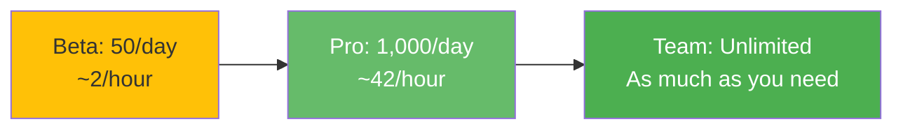

# Subscription Tier Matrix
**Beta, Pro, and Team Plans Explained**

---

## The 3 Tiers

Rivet-PRO offers **3 subscription levels** designed for different user needs:

```mermaid
graph LR
    A[🆓 Beta<br/>FREE<br/>Try it out!] --> B[💼 Pro<br/>$29/month<br/>Individual technician]
    B --> C[👥 Team<br/>$200/month<br/>Maintenance team]

    style A fill:#4CAF50,color:#fff
    style B fill:#2196F3,color:#fff
    style C fill:#9C27B0,color:#fff
```



---

## Complete Comparison Table

| Feature | Beta (FREE) | Pro | Team |
|---------|-------------|-----|------|
| **💵 Price** | $0/month | $29/month | $200/month |
| **🎁 Trial Period** | 7 days | N/A | N/A |
| **❓ Queries per Day** | 50 | 1,000 | Unlimited |
| **📸 Photos per Day** | Included in queries | Included in queries | Unlimited |
| **🖨️ Prints per Month** | 5 | Unlimited | Unlimited |
| **📦 Max Image Size** | 5 MB | 20 MB | 50 MB |
| **👥 User Accounts** | 1 | 1 | 10 |
| **📚 Shared Knowledge Library** | ❌ No | ❌ No | ✅ Yes |
| **👨‍💼 Admin Dashboard** | ❌ No | ❌ No | ✅ Yes |
| **🔌 API Access** | ❌ No | ❌ No | ✅ Yes |
| **💬 Support** | Community | Email | Priority + Phone |
| **📊 Usage Analytics** | Basic | Advanced | Enterprise |
| **🔒 Data Retention** | 7 days | 30 days | 365 days |

---

## Beta Tier 🆓

### Perfect For
- **Trying out Rivet-PRO** before committing
- **Occasional users** who troubleshoot once in a while
- **Learning** how the system works

### What You Get


### Limits

| What | Limit | Why |
|------|-------|-----|
| **Queries** | 50/day | Prevents abuse while allowing trial |
| **Trial** | 7 days | Time to evaluate before upgrading |
| **Prints** | 5/month | Sample the print feature |
| **Image Size** | 5 MB | Smaller photos for testing |
| **Users** | 1 account | Personal trial |

### Example Use Case

**John, Maintenance Technician:**
- Has a tricky Siemens PLC issue once a week
- Sends photo + question
- Gets expert troubleshooting
- 50 queries/day is way more than he needs
- **Cost: FREE for 7 days, then decides if Pro is worth it**

---

## Pro Tier 💼

### Perfect For
- **Professional technicians** working daily
- **Field service** engineers
- **Individual contractors**

### What You Get


### Limits

| What | Limit | Why |
|------|-------|-----|
| **Queries** | 1,000/day | ~40/hour if working 24/7 - more than enough! |
| **Prints** | Unlimited | Save all troubleshooting guides |
| **Image Size** | 20 MB | High-res equipment photos |
| **Users** | 1 account | Individual professional |
| **Data Retention** | 30 days | Recent history available |

### Example Use Case

**Sarah, Field Service Engineer:**
- Troubleshoots 20-30 equipment issues per day
- Sends photos of nameplates
- Prints troubleshooting guides to bring on-site
- Uses email support when stuck on complex issues
- **Cost: $29/month, saves hours of research time**

### ROI Calculation

**Time Saved:**
- Avg troubleshooting research: 30 minutes/issue
- Rivet-PRO response: 2 seconds
- **Saves:** 29 minutes 58 seconds per issue

**Value:**
- 20 issues/day × 30 min saved = **10 hours saved/day**
- At $50/hour labor rate = **$500/day saved**
- Monthly value: $500 × 22 workdays = **$11,000/month**
- **Cost:** $29/month
- **ROI:** 378x return on investment!

---

## Team Tier 👥

### Perfect For
- **Maintenance teams** (5-10 technicians)
- **Facilities management** companies
- **Manufacturing plants**
- **MSP (Managed Service Provider)** companies

### What You Get


### Team Features

#### 1. Shared Knowledge Library
**What:** Team members can share and favorite troubleshooting guides


**Benefits:**
- Avoid duplicate research
- Share best practices
- Build institutional knowledge

---

#### 2. Admin Dashboard
**What:** Managers see team usage, costs, and trends

**Dashboard Features:**
- User activity logs
- Cost tracking per user
- Most common equipment issues
- Response time metrics
- ROI calculator

**Example Dashboard:**
```
Team Usage - December 2025

Total Queries: 8,432
Total Cost: $200 (subscription)
AI Costs: $12.50 (covered by plan)

Top Users:
1. John: 2,431 queries
2. Sarah: 1,892 queries
3. Mike: 1,654 queries

Top Equipment:
1. Siemens PLCs (42%)
2. Rockwell VFDs (28%)
3. ABB Drives (18%)

Time Saved: 312 hours
Labor Value: $15,600
ROI: 78x
```

---

#### 3. API Access
**What:** Integrate Rivet-PRO into your own systems

**Use Cases:**
- CMMS (Computerized Maintenance Management System) integration
- Custom apps and workflows
- Automated equipment monitoring
- Batch troubleshooting

**Example API Call:**
```python
import requests

response = requests.post(
    "https://api.rivet-pro.com/v1/troubleshoot",
    headers={"Authorization": "Bearer YOUR_API_KEY"},
    json={
        "query": "Motor overheating",
        "equipment": {
            "manufacturer": "siemens",
            "model": "S7-1200"
        }
    }
)

print(response.json()["answer"])
```

---

### Example Use Case

**ABC Manufacturing Plant:**
- 8 maintenance technicians
- 50-100 equipment issues per day across team
- Shared library avoids duplicate questions
- Manager tracks ROI and usage patterns
- API integration with their CMMS system
- **Cost: $200/month for entire team**

### Team ROI Calculation

**Team Size:** 8 technicians
**Avg Issues:** 60/day total
**Time Saved:** 30 min/issue × 60 = **30 hours/day**
**Value:** 30 hours × $50/hour = **$1,500/day**
**Monthly Value:** $1,500 × 22 days = **$33,000/month**
**Cost:** $200/month
**ROI:** 165x return on investment!

---

## Feature-by-Feature Breakdown

### Queries per Day



**What counts as a query?**
- Each photo + question = 1 query
- Each text question = 1 query
- Follow-up questions = separate queries

---

### Print Feature

**What:** Download troubleshooting guides as PDF for offline use

**Use Cases:**
- Print before going to job site (no internet)
- Add to maintenance logs
- Share with coworkers
- Archive for compliance

| Tier | Prints/Month | Use Case |
|------|--------------|----------|
| Beta | 5 | Try it out |
| Pro | Unlimited | Print every guide you need |
| Team | Unlimited | Team shares prints |

---

### Image Size Limits

**Why it matters:** Higher resolution = better OCR

| Tier | Max Size | Photo Quality |
|------|----------|---------------|
| Beta | 5 MB | Phone photo (standard quality) |
| Pro | 20 MB | High-res photos, zoom in on details |
| Team | 50 MB | Professional camera photos |

**Example:**
- 5 MB: iPhone photo at normal resolution
- 20 MB: iPhone photo at max resolution
- 50 MB: DSLR camera photo

---

### Data Retention

**How long your history is saved:**

| Tier | Retention | Use Case |
|------|-----------|----------|
| Beta | 7 days | Recent trial history |
| Pro | 30 days | Last month of work |
| Team | 365 days | Full year for compliance/audit |

---

## Upgrade Paths

### From Beta to Pro


**What happens:**
- Trial ends, automatically prompts to upgrade
- Credit card required for Pro
- Instant upgrade, no downtime
- Usage resets to Pro limits

---

### From Pro to Team


**What happens:**
- Prorated billing (credit for unused Pro days)
- Invite team members via email
- Admin gets dashboard access
- API keys generated

---

## Payment & Billing

### Accepted Payment Methods
- 💳 Credit/debit cards (Visa, Mastercard, Amex)
- 🏦 ACH direct debit (Team tier only)
- 🌍 International cards accepted

### Billing Cycle
- **Monthly:** Charged on same day each month
- **Annual:** 10% discount (coming soon)

### Cancellation Policy
- **Cancel anytime** - no contracts
- **Prorated refunds** if canceled mid-month
- **Data access** continues until end of billing period

---

## Limits & Fair Use

### Rate Limiting

All tiers have soft limits to prevent abuse:

| Tier | Queries/Day | Queries/Hour | Queries/Minute |
|------|-------------|--------------|----------------|
| Beta | 50 | 10 | 3 |
| Pro | 1,000 | 100 | 10 |
| Team | Unlimited* | 500 | 50 |

*Unlimited = fair use policy, extremely high limits

### What Happens if You Hit Limits?

```
⚠️ Daily limit reached (50 queries)

You've used all your queries for today.

Options:
1. Wait until tomorrow (resets at midnight UTC)
2. Upgrade to Pro ($29/month for 1,000/day)
3. Contact support for exception

Your trial expires in 3 days.
```

---

## Free vs Paid Comparison

### What's the Same (All Tiers)

✅ Access to all 7 vendor experts
✅ OCR photo reading
✅ 4-route decision system
✅ Safety warnings included
✅ Confidence scores shown
✅ Cost tracking transparency
✅ Telegram bot interface

### What's Different

| Feature | Beta | Pro | Team |
|---------|------|-----|------|
| Daily queries | 50 | 1,000 | ♾️ |
| Support | Community | Email | Priority |
| Users | 1 | 1 | 10 |
| API | ❌ | ❌ | ✅ |
| Shared library | ❌ | ❌ | ✅ |

---

## Recommendations

### Choose Beta If:
- ✅ You're trying it out for the first time
- ✅ You only troubleshoot occasionally (<50 issues/day)
- ✅ You want to see if it's worth paying for

### Choose Pro If:
- ✅ You're a field technician or engineer
- ✅ You troubleshoot 20-100 issues/day
- ✅ You need unlimited prints
- ✅ You want email support

### Choose Team If:
- ✅ You have 5-10 technicians
- ✅ You want shared knowledge library
- ✅ You need admin dashboard and usage tracking
- ✅ You want API integration with your CMMS
- ✅ You need priority support

---

## Key Takeaways

### For Users:
- **Beta is FREE** - try it risk-free!
- **Pro is affordable** - $29/month saves hours of research
- **Team is powerful** - $200/month for entire team

### For Developers:
- **3 tiers** cover hobbyist → enterprise
- **Stripe integration** handles billing (Phase 4)
- **Rate limiting** prevents abuse
- **Usage tracking** enables fair pricing

---

## Related Docs

- [External Dependencies](../integrations/external_dependencies.md) - Stripe integration
- [System Overview](../architecture/system_overview.md) - Tier enforcement points

---

**Last Updated:** 2026-01-03
**Status:** 🟡 Planned (Phase 4-5 implementation)
**Difficulty:** ⭐ Beginner Friendly
