# External Service Integrations
**All the Outside Services Rivet-PRO Connects To**

---

## What Are External Dependencies?

These are services run by other companies that Rivet-PRO uses to work. Think of them like:
- **Groq/Claude/GPT** = The AI brains
- **Telegram** = The messenger
- **Stripe** = The payment processor

---

## Complete Integration Map

```mermaid
graph TB
    subgraph RIVET["🏠 RIVET-PRO CORE"]
        APP[Your App]
    end

    subgraph AI["🤖 AI PROVIDERS - The Brains"]
        GROQ[Groq<br/>FREE Vision + Text]
        GEMINI[Google Gemini<br/>$$ Vision + Text]
        CLAUDE[Anthropic Claude<br/>$$ Reasoning]
        OPENAI[OpenAI GPT<br/>$$$ Fallback]
    end

    subgraph COMM["💬 COMMUNICATION"]
        TG[Telegram Bot API<br/>FREE Messaging]
    end

    subgraph PAY["💳 PAYMENTS"]
        STRIPE[Stripe<br/>Payment Platform]
    end

    subgraph OBS["📊 MONITORING"]
        LS[LangSmith<br/>Cloud Tracing]
        PH[Phoenix AI<br/>Self-Hosted Tracing]
    end

    subgraph FUTURE["🔮 PHASE 3"]
        DB[(PostgreSQL<br/>User Database)]
        REDIS[(Redis<br/>Cache/Queue)]
    end

    APP --> GROQ
    APP --> GEMINI
    APP --> CLAUDE
    APP --> OPENAI
    APP --> TG
    APP --> STRIPE
    APP --> LS
    APP --> PH
    APP -.-> DB
    APP -.-> REDIS

    style APP fill:#4CAF50,color:#fff
    style GROQ fill:#66BB6A,color:#fff
    style GEMINI fill:#FFC107
    style CLAUDE fill:#FF9800,color:#fff
    style OPENAI fill:#F44336,color:#fff
    style TG fill:#2196F3,color:#fff
    style STRIPE fill:#9C27B0,color:#fff
    style LS fill:#607D8B,color:#fff
    style PH fill:#607D8B,color:#fff
    style DB fill:#9E9E9E
    style REDIS fill:#9E9E9E
```



---

## Service Details Table

| Service | What It Does | Cost | Status | Required? |
|---------|--------------|------|--------|-----------|
| **Groq** | Free AI for vision and text | FREE | ✅ Active | ⭐ Yes |
| **Gemini** | Google's AI fallback | $0.075-$1.25/1M tokens | ✅ Active | ⭐ Yes |
| **Claude** | Advanced reasoning AI | $0.00025-$0.015/1K tokens | ✅ Active | ⭐ Yes |
| **GPT** | OpenAI fallback | $0.0005-$0.015/1K tokens | ✅ Active | ⭐ Yes |
| **Telegram** | User messaging | FREE | 🟡 Partial | ⭐ Yes (production) |
| **Stripe** | Payment processing | 2.9% + $0.30/transaction | 🟡 Partial | 🔷 Optional |
| **LangSmith** | Cloud observability | Usage-based | ✅ Active | 🔷 Optional |
| **Phoenix** | Self-hosted tracing | FREE (self-host) | ✅ Active | 🔷 Optional |
| **PostgreSQL** | User database | Hosting cost | ❌ Phase 3 | 🔮 Future |
| **Redis** | Cache + queue | Hosting cost | ❌ Phase 3 | 🔮 Future |

---

## Configuration Requirements

### Environment Variables Needed

```bash
# AI PROVIDERS (at least one required)
GROQ_API_KEY=gsk_...              # Groq (free, recommended!)
GEMINI_API_KEY=AIza...            # Google Gemini
ANTHROPIC_API_KEY=sk-ant-...      # Anthropic Claude
OPENAI_API_KEY=sk-...             # OpenAI GPT

# USER INTERFACE (production use)
TELEGRAM_BOT_TOKEN=123456:ABC...  # Telegram bot
TELEGRAM_ADMIN_IDS=123456,789012  # Admin user IDs

# PAYMENTS (Phase 4)
STRIPE_SECRET_KEY=sk_test_...     # Stripe API key
STRIPE_WEBHOOK_SECRET=whsec_...   # Webhook verification
STRIPE_PRICE_PRO=price_...        # Pro tier price ID
STRIPE_PRICE_TEAM=price_...       # Team tier price ID

# OBSERVABILITY (optional)
LANGSMITH_API_KEY=ls_...          # LangSmith tracing
PHOENIX_ENDPOINT=http://...       # Phoenix server URL

# DATABASE (Phase 3)
DATABASE_URL=postgresql://...     # PostgreSQL connection
REDIS_URL=redis://...             # Redis connection
```

---

## Service-by-Service Breakdown

### 1. Groq (FREE AI)

**What:** Free AI models for vision and text
**Why:** Primary AI provider - saves tons of money!


| Detail | Value |
|--------|-------|
| **Website** | https://groq.com |
| **Models** | llama-3.2-90b-vision, llama-3.1-70b |
| **Cost** | $0.00 (currently free tier) |
| **Speed** | Very fast (optimized hardware) |
| **Usage** | OCR first try, all text generation first try |
| **Config** | `GROQ_API_KEY` |
| **Required?** | ⭐ Highly recommended (saves $$$) |

**Used in:**
- `rivet/integrations/llm.py` - Vision and text provider
- `rivet/workflows/ocr.py` - First OCR attempt
- All SME experts - First text generation attempt

---

### 2. Google Gemini

**What:** Google's AI models for backup
**Why:** Better accuracy than Groq when needed


| Detail | Value |
|--------|-------|
| **Website** | https://ai.google.dev |
| **Models** | gemini-1.5-flash, gemini-1.5-pro |
| **Cost** | $0.075-$1.25 per 1M tokens |
| **Speed** | Fast |
| **Usage** | OCR fallback, text generation fallback |
| **Config** | `GEMINI_API_KEY` |
| **Required?** | ⭐ Yes (fallback chain) |

**Used in:**
- `rivet/integrations/llm.py` - Vision and text provider
- `rivet/workflows/ocr.py` - Second OCR attempt

---

### 3. Anthropic Claude

**What:** Advanced reasoning AI
**Why:** Best for complex troubleshooting


| Detail | Value |
|--------|-------|
| **Website** | https://anthropic.com |
| **Models** | claude-3-haiku, claude-3-5-sonnet |
| **Cost** | $0.00025-$0.015 per 1K tokens |
| **Speed** | Medium |
| **Usage** | Complex reasoning, Route 4 fallback |
| **Config** | `ANTHROPIC_API_KEY` |
| **Required?** | ⭐ Yes (fallback route) |

**Used in:**
- `rivet/integrations/llm.py` - Text provider for complex tasks
- `rivet/workflows/general.py` - Route 4 fallback
- `rivet/workflows/ocr.py` - Third OCR attempt

---

### 4. OpenAI GPT

**What:** OpenAI's AI models
**Why:** Last-resort fallback


| Detail | Value |
|--------|-------|
| **Website** | https://platform.openai.com |
| **Models** | gpt-3.5-turbo, gpt-4o-mini, gpt-4o |
| **Cost** | $0.0005-$0.015 per 1K tokens |
| **Speed** | Medium-Slow |
| **Usage** | Final OCR fallback, complex tasks |
| **Config** | `OPENAI_API_KEY` |
| **Required?** | ⭐ Yes (last resort) |

**Used in:**
- `rivet/integrations/llm.py` - Last fallback provider
- `rivet/workflows/ocr.py` - Fourth OCR attempt

---

### 5. Telegram Bot API

**What:** Messaging platform for user interaction
**Why:** Main user interface


| Detail | Value |
|--------|-------|
| **Website** | https://core.telegram.org/bots |
| **Purpose** | Send/receive messages, photos |
| **Cost** | FREE |
| **Speed** | Real-time |
| **Usage** | Primary user interface |
| **Config** | `TELEGRAM_BOT_TOKEN`, `TELEGRAM_ADMIN_IDS` |
| **Required?** | ⭐ For production use |

**Used in:**
- `rivet/integrations/telegram.py` - Bot handlers
- Entry point: `python -m rivet.integrations.telegram`

---

### 6. Stripe

**What:** Payment processing platform
**Why:** Handle subscriptions and billing


| Detail | Value |
|--------|-------|
| **Website** | https://stripe.com |
| **Purpose** | Subscriptions, payments, webhooks |
| **Cost** | 2.9% + $0.30 per transaction |
| **Speed** | Instant |
| **Usage** | Beta/Pro/Team tier subscriptions |
| **Config** | `STRIPE_SECRET_KEY`, webhooks, price IDs |
| **Required?** | 🔷 Only for paid tiers |

**Status:** 🟡 Partial implementation (Phase 4)

**Used in:**
- `rivet/integrations/stripe.py` - Payment handlers
- Subscription management functions

---

### 7. LangSmith (Observability)

**What:** Cloud-based AI observability
**Why:** Track AI performance and costs


| Detail | Value |
|--------|-------|
| **Website** | https://smith.langchain.com |
| **Purpose** | Track AI calls, costs, performance |
| **Cost** | Usage-based pricing |
| **Speed** | Async (doesn't slow app) |
| **Usage** | Optional monitoring |
| **Config** | `LANGSMITH_API_KEY` |
| **Required?** | 🔷 Optional (development) |

**Used in:**
- `rivet/observability/tracer.py` - Tracing decorator

---

### 8. Phoenix AI (Observability)

**What:** Self-hosted observability platform
**Why:** Free alternative to LangSmith


| Detail | Value |
|--------|-------|
| **Website** | https://phoenix.arize.com |
| **Purpose** | Track AI calls, self-hosted |
| **Cost** | FREE (you host it) |
| **Speed** | Async |
| **Usage** | Optional monitoring |
| **Config** | `PHOENIX_ENDPOINT` |
| **Required?** | 🔷 Optional (development) |

**Used in:**
- `rivet/observability/tracer.py` - Tracing decorator

---

### 9. PostgreSQL (Phase 3)

**What:** Relational database
**Why:** Store users, usage data, knowledge atoms


| Detail | Value |
|--------|-------|
| **Purpose** | Persistent data storage |
| **Cost** | Hosting (e.g., $7/month on Railway) |
| **Usage** | User accounts, usage, KB, research |
| **Config** | `DATABASE_URL` |
| **Required?** | 🔮 Phase 3 |

**Status:** ❌ Not implemented yet

**Will store:**
- User accounts and subscription tiers
- Usage tracking (queries per day)
- Knowledge base atoms (vector embeddings)
- Research queue (unanswered questions)

---

### 10. Redis (Phase 3)

**What:** In-memory cache and queue
**Why:** Fast rate limiting and job queue


| Detail | Value |
|--------|-------|
| **Purpose** | Cache, rate limiting, job queue |
| **Cost** | Hosting (e.g., $3/month on Upstash) |
| **Usage** | Rate limiting, research queue |
| **Config** | `REDIS_URL` |
| **Required?** | 🔮 Phase 3 |

**Status:** ❌ Not implemented yet

**Will handle:**
- Rate limiting (50/1000/unlimited queries per day)
- Research job queue (async KB improvement)
- Session caching (user preferences)

---

## Cost Summary

### Monthly Operating Costs (Estimated)

| Service | Beta Tier | Pro Tier | Team Tier |
|---------|-----------|----------|-----------|
| AI Calls (Groq/etc) | ~$1.50 | ~$30 | ~$150 |
| Telegram | FREE | FREE | FREE |
| Stripe Fees | N/A | ~$0.87 | ~$5.80 |
| Observability | FREE | FREE | FREE |
| Database (Phase 3) | ~$7 | ~$15 | ~$50 |
| Redis (Phase 3) | ~$3 | ~$10 | ~$25 |
| **TOTAL** | **~$11.50** | **~$55.87** | **~$230.80** |
| **Revenue** | $0 | $29 | $200 |
| **Margin** | -$11.50 | -$26.87 | -$30.80 |

**Note:** Beta tier needs subsidization. Pro/Team margins improve with scale.

---

## Required vs Optional

### Minimum to Run (Development)

```
✅ GROQ_API_KEY (free!)
✅ GEMINI_API_KEY
✅ ANTHROPIC_API_KEY
✅ OPENAI_API_KEY
```

**That's it!** You can test locally without Telegram, Stripe, databases.

### Production Deployment

```
✅ All AI keys (above)
✅ TELEGRAM_BOT_TOKEN
✅ TELEGRAM_ADMIN_IDS
🔷 STRIPE_SECRET_KEY (if paid tiers)
🔷 LANGSMITH_API_KEY (if monitoring)
🔮 DATABASE_URL (Phase 3)
🔮 REDIS_URL (Phase 3)
```

---

## Service Health Monitoring

### How to Check if Services Are Up

```bash
# Test Groq
curl https://api.groq.com/openai/v1/models \
  -H "Authorization: Bearer $GROQ_API_KEY"

# Test Gemini
curl "https://generativelanguage.googleapis.com/v1/models?key=$GEMINI_API_KEY"

# Test Claude
curl https://api.anthropic.com/v1/messages \
  -H "x-api-key: $ANTHROPIC_API_KEY"

# Test OpenAI
curl https://api.openai.com/v1/models \
  -H "Authorization: Bearer $OPENAI_API_KEY"

# Test Telegram Bot
curl "https://api.telegram.org/bot$TELEGRAM_BOT_TOKEN/getMe"
```

---

## Key Takeaways

### For Users:
- **You need:** A Telegram account (free!)
- **We need:** API keys for AI services
- **Costs:** Covered by subscription fees

### For Developers:
- **4 AI providers** for redundancy
- **Free Groq** saves ~73% on costs
- **Telegram** is free messaging
- **Stripe** handles payments (Phase 4)
- **Observability** is optional but helpful

---

## Related Docs

- [Cost Optimization](./llm_provider_chain.md) - How AI costs are minimized
- [System Overview](../architecture/system_overview.md) - Where services fit
- [Configuration Guide](../../rivet/config.py) - Settings management

---

**Last Updated:** 2026-01-03
**Difficulty:** ⭐⭐ Beginner Friendly
