# AI Cost Optimization Strategy
**How Rivet-PRO Saves Money on AI Calls**

---

## The Big Idea

AI calls cost money. Some AI models are free, some cost a little, and some are expensive.

**Rivet-PRO's strategy:** Try the free AI first. If it can't do the job well enough, try a slightly more expensive one. Only use the expensive AI as a last resort.

**Result:** Save ~73% on AI costs!

---

## The Two Types of AI Tasks

### 1. Vision Tasks (Reading Photos)

Used for OCR (Optical Character Recognition) - reading equipment nameplates.

### 2. Text Tasks (Answering Questions)

Used for troubleshooting, generating answers, etc.

---

## Vision Provider Chain (OCR)

### The Strategy

```mermaid
graph TD
    START[📸 Equipment Photo] --> TRY1

    TRY1[🆓 TRY #1: Groq<br/>llama-3.2-90b-vision<br/>━━━━━━━<br/>Cost: $0.00 FREE<br/>Speed: Fast 0.8s]

    TRY1 --> CHECK1{Good enough?<br/>Confidence ≥ 70%}

    CHECK1 -->|✅ YES| WIN1[✅ USE THIS RESULT<br/>Cost: $0.00<br/>Savings: 100%!]

    CHECK1 -->|❌ NO<br/>Too uncertain| TRY2

    TRY2[💵 TRY #2: Gemini<br/>gemini-1.5-flash<br/>━━━━━━━<br/>Cost: ~$0.0001<br/>Speed: Fast 0.7s]

    TRY2 --> CHECK2{Good enough?<br/>Confidence ≥ 75%}

    CHECK2 -->|✅ YES| WIN2[✅ USE THIS RESULT<br/>Cost: $0.0001<br/>Savings: 98%]

    CHECK2 -->|❌ NO| TRY3

    TRY3[💰 TRY #3: Claude<br/>claude-3-haiku<br/>━━━━━━━<br/>Cost: ~$0.0005<br/>Speed: Medium 0.9s]

    TRY3 --> CHECK3{Good enough?<br/>Confidence ≥ 80%}

    CHECK3 -->|✅ YES| WIN3[✅ USE THIS RESULT<br/>Cost: $0.0005<br/>Savings: 90%]

    CHECK3 -->|❌ NO| TRY4

    TRY4[💸 TRY #4: GPT-4o<br/>gpt-4o<br/>━━━━━━━<br/>Cost: ~$0.005<br/>Speed: Slower 1.2s]

    TRY4 --> WIN4[✅ USE BEST RESULT<br/>Cost: $0.005<br/>Last resort]

    style START fill:#4CAF50,color:#fff
    style WIN1 fill:#66BB6A,color:#fff
    style WIN2 fill:#81C784,color:#fff
    style WIN3 fill:#9CCC65,color:#fff
    style WIN4 fill:#FFA726,color:#fff
    style TRY1 fill:#66BB6A,color:#fff
    style TRY2 fill:#FFC107
    style TRY3 fill:#FF9800,color:#fff
    style TRY4 fill:#F44336,color:#fff
```



### Cost Comparison

| Provider | Model | Cost per Image | Speed | When Used |
|----------|-------|----------------|-------|-----------|
| 🆓 **Groq** | llama-3.2-90b-vision | **$0.00** | 0.8s | First try - FREE! |
| 💵 **Gemini** | gemini-1.5-flash | ~$0.0001 | 0.7s | If Groq fails |
| 💰 **Claude** | claude-3-haiku | ~$0.0005 | 0.9s | If Gemini fails |
| 💸 **GPT-4o** | gpt-4o | ~$0.005 | 1.2s | Last resort |

**Savings Example:**
- If Groq works (70% of time): Save 100% vs GPT-4o!
- If Gemini works (20% of time): Save 98%
- If Claude works (8% of time): Save 90%
- Only 2% of images need expensive GPT-4o

---

## Text Generation Tiers

For text-based tasks (answering questions), we use different AI models based on complexity:


### Tier Breakdown

#### Tier 1: SIMPLE Tasks
**When:** Basic queries, simple explanations
**Models:**
1. Groq (llama-3.1-70b) - $0.00 FREE
2. GPT-3.5-turbo - ~$0.0005/1K tokens

**Example:** "What is LOTO?" → Use free Groq

---

#### Tier 2: MODERATE Tasks
**When:** Vendor expert troubleshooting, equipment-specific answers
**Models:**
1. Groq (llama-3.1-70b) - $0.00 FREE
2. GPT-4o-mini - ~$0.0003/1K tokens
3. Claude Haiku - ~$0.00025/1K tokens

**Example:** Siemens SME troubleshooting → Try Groq first

**This is what most questions use!**

---

#### Tier 3: COMPLEX Tasks
**When:** General fallback, deep reasoning needed
**Models:**
1. Claude Sonnet - ~$0.003/1K tokens
2. GPT-4o - ~$0.005/1K tokens

**Example:** Route 4 (General Fallback) → Use Claude Sonnet

---

#### Tier 4: RESEARCH Tasks
**When:** Multi-step analysis, complex research
**Models:**
1. Claude Sonnet - ~$0.003/1K tokens
2. GPT-4o - ~$0.005/1K tokens

**Example:** (Phase 3) Research worker analyzing knowledge gaps

---

## Real-World Cost Examples

### Example 1: Groq Success (Most Common)

```
Question: "Siemens S7-1200 F-0002 error"

OCR Phase:
  Groq vision: $0.00 ✅ Confidence 85%
  Total: $0.00

Troubleshooting Phase:
  Siemens SME uses Groq: $0.00 ✅ Good answer
  Total: $0.00

TOTAL COST: $0.00 (100% savings!)
```

### Example 2: Moderate OCR, Groq Text

```
Question: "ControlLogix fault with photo"

OCR Phase:
  Groq vision: $0.00 ❌ Low confidence
  Gemini vision: $0.0001 ✅ Confidence 78%
  Total: $0.0001

Troubleshooting Phase:
  Rockwell SME uses Groq: $0.00 ✅ Good answer
  Total: $0.00

TOTAL COST: $0.0001 (98% savings!)
```

### Example 3: Full Escalation (Rare)

```
Question: "Complex equipment with hard-to-read nameplate"

OCR Phase:
  Groq vision: $0.00 ❌ Failed
  Gemini vision: $0.0001 ❌ Still unclear
  Claude vision: $0.0005 ❌ Hard to read
  GPT-4o vision: $0.005 ✅ Best effort
  Total: $0.0056

Troubleshooting Phase:
  No brand detected → Generic SME
  Generic SME uses Groq: $0.00 ✅
  Total: $0.00

TOTAL COST: $0.0056 (still reasonable!)
```

### Example 4: Fallback Route

```
Question: "Generic motor issue, no photo"

Troubleshooting Phase:
  Route 1 (KB): $0.0001 ❌ Not found
  Route 2 (Generic SME): $0.00 (Groq) ❌ Uncertain (68%)
  Route 3 (Research): $0.00 (just logging)
  Route 4 (General): $0.004 (Claude Sonnet) ✅
  Total: $0.0041

TOTAL COST: $0.0041 (multiple routes needed)
```

---

## Monthly Cost Projections

### By Usage Level

| Tier | Questions/Day | Avg Cost/Q | Monthly Cost | Annual Cost |
|------|---------------|------------|--------------|-------------|
| **Beta** | 50 | $0.001 | ~$1.50 | ~$18 |
| **Pro** | 1,000 | $0.001 | ~$30 | ~$360 |
| **Team** | 5,000 | $0.001 | ~$150 | ~$1,800 |

**Note:** These are AI costs only. Actual subscription prices include profit margin, infrastructure, support.

---

## Provider Selection Logic

### How the System Decides

```mermaid
flowchart TD
    START([AI Call Needed]) --> TYPE{Task Type?}

    TYPE -->|Vision OCR| VISION[Vision Chain]
    TYPE -->|Text Generation| TEXT[Text Chain]

    VISION --> V1{Try Groq<br/>Cost: $0}

    V1 -->|Success<br/>Confidence ≥ 70%| DONE1[✅ Done<br/>$0]
    V1 -->|Failed| V2

    V2{Try Gemini<br/>Cost: $}
    V2 -->|Success<br/>Confidence ≥ 75%| DONE2[✅ Done<br/>$0.0001]
    V2 -->|Failed| V3

    V3{Try Claude<br/>Cost: $$}
    V3 -->|Success<br/>Confidence ≥ 80%| DONE3[✅ Done<br/>$0.0005]
    V3 -->|Failed| V4

    V4[Try GPT-4o<br/>Cost: $$$]
    V4 --> DONE4[✅ Done<br/>$0.005]

    TEXT --> TIER{Complexity<br/>Tier?}

    TIER -->|SIMPLE| TS[Try Groq → GPT-3.5]
    TIER -->|MODERATE| TM[Try Groq → GPT-4o-mini → Claude Haiku]
    TIER -->|COMPLEX| TC[Try Claude Sonnet → GPT-4o]

    TS --> DONE_S[✅ Done<br/>~$0]
    TM --> DONE_M[✅ Done<br/>~$0.001]
    TC --> DONE_C[✅ Done<br/>~$0.004]

    style START fill:#4CAF50,color:#fff
    style DONE1 fill:#66BB6A,color:#fff
    style DONE2 fill:#81C784,color:#fff
    style DONE3 fill:#9CCC65,color:#fff
    style DONE4 fill:#FFA726,color:#fff
    style DONE_S fill:#66BB6A,color:#fff
    style DONE_M fill:#FFC107
    style DONE_C fill:#FF9800,color:#fff
```



---

## Lazy Loading

### What Is It?

The system doesn't connect to all AI providers immediately. It only loads the client when needed.


### Why?
- **Faster startup**: Don't wait for all clients
- **Lower memory**: Only active clients in memory
- **Cleaner**: If API key missing, only error when needed

---

## Key Optimization Techniques

### 1. Early Exit
Stop trying providers once confidence threshold met.

```
✅ GOOD:
Groq works → STOP (saved $0.005)

❌ BAD:
Groq works → Still try Gemini → Still try Claude → Wasted money!
```

### 2. Confidence Thresholds
Different confidence requirements for different providers:

```
Groq: Need 70% to accept
Gemini: Need 75% to accept
Claude: Need 80% to accept
GPT-4o: Accept anything (last resort)
```

### 3. Capability Matching
Don't use expensive AI for simple tasks:

```
Simple question: "What is LOTO?"
  ✅ Use Groq (free)
  ❌ Don't use Claude Sonnet (expensive)

Complex reasoning: "Design safety system"
  ❌ Don't use Groq (not capable enough)
  ✅ Use Claude Sonnet (has reasoning skills)
```

### 4. Cost Tracking
Every AI call records its cost. System knows total spending.

```json
{
  "llm_calls": 2,
  "cost_usd": 0.0021,
  "providers_used": ["groq", "claude-haiku"]
}
```

---

## Cost Monitoring

### What Gets Tracked

```mermaid
graph LR
    A[AI Call] --> B[Cost Tracking]

    B --> C[Per Request:<br/>• Provider used<br/>• Model name<br/>• Tokens used<br/>• Cost in USD]

    B --> D[Aggregated:<br/>• Total cost<br/>• LLM calls count<br/>• Average cost/query]

    C & D --> E[Observability<br/>Dashboard]

    style A fill:#4CAF50,color:#fff
    style B fill:#2196F3,color:#fff
    style E fill:#FF9800,color:#fff
```



### Example Logged Data

```json
{
  "timestamp": "2026-01-03T14:32:01Z",
  "query": "Siemens F-0002 error",
  "route": "sme",
  "sme_vendor": "siemens",
  "llm_calls": [
    {
      "purpose": "ocr",
      "provider": "groq",
      "model": "llama-3.2-90b-vision",
      "cost_usd": 0.0,
      "tokens": 1250
    },
    {
      "purpose": "sme_troubleshoot",
      "provider": "groq",
      "model": "llama-3.1-70b",
      "cost_usd": 0.0,
      "tokens": 890
    }
  ],
  "total_cost_usd": 0.0,
  "total_llm_calls": 2
}
```

---

## Why This Strategy Works

### 1. Most Questions Are Simple
- 70% of OCR can be done with free Groq
- 80% of text generation can use free Groq
- Only complex cases need expensive AI

### 2. Progressive Enhancement
- Start cheap
- Only upgrade if needed
- Never waste money on overkill

### 3. Transparent Costs
- User sees cost in response metadata
- Developers can optimize expensive queries
- Business can predict expenses

---

## Related Docs

- [Data Flow](../architecture/data_flow.md) - See cost accumulation in action
- [4-Route System](../workflows/troubleshooting_decision_tree.md) - Cost per route
- [System Overview](../architecture/system_overview.md) - Integration layer

---

**File Location:** `rivet/integrations/llm.py`
**Last Updated:** 2026-01-03
**Difficulty:** ⭐⭐ Beginner Friendly
