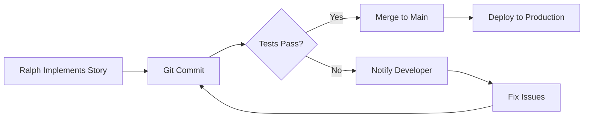

# Ralph Automated Testing Guide

## Overview

Ralph now has comprehensive automated testing that runs after each story implementation. Tests verify code quality, functionality, and prevent regressions.

## Architecture

```
Ralph Story Implementation
    ↓
Code Committed
    ↓
Test Harness Runs Automatically
    ↓
Results Saved to Database & Telegram
```

## Test Types

### 1. Code Quality
- **Linting** (ruff): Checks code style and common errors
- **Type Checking** (mypy): Validates type hints

### 2. Functional Tests
- **Unit Tests**: Test individual functions/methods
- **Integration Tests**: Test component interactions
- **Feature Tests**: Test complete user workflows

### 3. Database Tests
- **Schema Validation**: Ensures all tables exist
- **Migration Tests**: Verifies migrations work
- **Data Integrity**: Checks foreign keys and constraints

### 4. Performance Tests
- **Response Time**: API endpoints under 500ms
- **Query Performance**: Database queries optimized
- **Memory Usage**: No memory leaks

### 5. Regression Tests
- **Full Suite**: Runs all existing tests
- **Breaking Changes**: Detects API changes

## KB Feature Tests

### Test Coverage for KB Stories

Each KB story has specific test coverage:

#### KB-006: Create atoms from approved Ralph fixes
```python
test_create_atom_from_feedback_exists()
test_feedback_to_atom_pipeline()
```

#### KB-007: Add knowledge base analytics service
```python
test_analytics_service_exists()
test_get_learning_stats()
test_get_kb_hit_rate()
test_get_response_time_comparison()
```

#### KB-008: Add /kb_stats command
```python
test_kb_stats_command_exists()
test_kb_stats_returns_formatted_message()
test_kb_stats_admin_only()
```

#### CRITICAL-KB-001: Knowledge atoms not being created
```python
test_atoms_created_after_ocr()
test_atoms_linked_to_interactions()
```

#### KB-002: Create SPEC atom after manual found
```python
test_create_manual_atom_helper_exists()
test_atom_created_after_manual_search()
```

## Running Tests Manually

### Run all KB tests:
```bash
cd /root/Rivet-PRO
python3 -m pytest tests/ralph/test_kb_features.py -v
```

### Run specific test class:
```bash
pytest tests/ralph/test_kb_features.py::TestKB006_CreateAtomsFromRalphFixes -v
```

### Run test harness for a story:
```bash
python3 tests/ralph/ralph_test_harness.py KB-006 abc123def
```

### Run tests on VPS:
```bash
ssh root@72.60.175.144
cd /root/Rivet-PRO
source venv/bin/activate
pytest tests/ralph/ -v --tb=short
```

## Automated Testing Flow

Ralph automatically runs tests after each story:

1. **Story Implemented** - Ralph completes KB-006
2. **Code Committed** - Changes committed with message `feat(KB-006): ...`
3. **Tests Triggered** - `ralph_test_integration.sh` runs
4. **Test Harness Executes**:
   - Linting
   - Type checking
   - Unit tests
   - Integration tests
   - Feature-specific tests
   - Performance benchmarks
   - Regression check
5. **Results Saved** - Test status saved to `ralph_stories.test_status`
6. **Notification Sent** - Telegram message with results

## Test Results in Database

```sql
SELECT
    story_id,
    test_status,
    test_results->>'overall_status' as status,
    tested_at
FROM ralph_stories
WHERE test_status IS NOT NULL
ORDER BY tested_at DESC;
```

## GitHub Actions Integration

Tests also run on GitHub when Ralph pushes to `ralph/**` branches:

- **Trigger**: Push to any `ralph/*` branch
- **Environment**: Ubuntu with Python 3.12
- **Secrets Required**:
  - `DATABASE_URL`
  - `ANTHROPIC_API_KEY`
  - `TELEGRAM_BOT_TOKEN`
  - `TELEGRAM_ADMIN_CHAT_ID`

## Test Requirements

### Dependencies
```bash
pip install pytest pytest-asyncio pytest-benchmark ruff mypy asyncpg
```

### Environment Variables
```bash
export DATABASE_URL="postgresql://..."
export ANTHROPIC_API_KEY="sk-ant-..."
export TELEGRAM_BOT_TOKEN="123456789:..."
```

## Writing Tests for New Features

### 1. Create test file in `tests/ralph/`

```python
"""Tests for STORY-XXX: Feature name"""
import pytest

class TestSTORYXXX_FeatureName:
    @pytest.mark.asyncio
    async def test_feature_exists(self, db_pool):
        """Verify feature was implemented"""
        # Test code here
        pass
```

### 2. Add to test harness mapping

Edit `ralph_test_harness.py`:
```python
test_mapping = {
    'KB': 'tests/ralph/test_kb_features.py',
    'STORY': 'tests/ralph/test_story_features.py',  # Add new mapping
}
```

### 3. Run tests

```bash
pytest tests/ralph/test_story_features.py -v
```

## Monitoring Test Health

### Check recent test runs:
```bash
cd /root/ralph
./scripts/db_manager.sh query "
SELECT
    story_id,
    test_status,
    tested_at,
    test_results->>'overall_status'
FROM ralph_stories
WHERE tested_at > NOW() - INTERVAL '7 days'
ORDER BY tested_at DESC;
"
```

### View test failure rate:
```bash
./scripts/db_manager.sh query "
SELECT
    test_status,
    COUNT(*) as count,
    ROUND(100.0 * COUNT(*) / SUM(COUNT(*)) OVER(), 2) as percentage
FROM ralph_stories
WHERE test_status IS NOT NULL
GROUP BY test_status;
"
```

## Troubleshooting

### Tests not running?

1. **Check test harness permissions:**
   ```bash
   chmod +x tests/ralph/ralph_test_harness.py
   ```

2. **Verify dependencies installed:**
   ```bash
   pip list | grep pytest
   ```

3. **Check database connection:**
   ```bash
   psql "$DATABASE_URL" -c "SELECT 1;"
   ```

### Tests failing unexpectedly?

1. **Run with verbose output:**
   ```bash
   pytest tests/ralph/ -vv --tb=long
   ```

2. **Check test logs:**
   ```bash
   tail -100 /root/ralph/logs/*_test.log
   ```

3. **Verify database schema:**
   ```bash
   python3 tests/ralph/ralph_test_harness.py --check-schema
   ```

## Performance Benchmarks

KB features should meet these benchmarks:

| Operation | Target | Test |
|-----------|--------|------|
| KB Query | < 500ms | `test_kb_query_under_500ms` |
| Atom Creation | < 1s | `test_atom_creation_under_1s` |
| Analytics Stats | < 2s | `test_get_learning_stats` |
| Manual Search | < 5s | `test_manual_search_performance` |

## CI/CD Pipeline



## Next Steps

1. ✅ KB features tested automatically
2. ✅ Test harness integrated with Ralph
3. ✅ GitHub Actions workflow configured
4. 🔄 Add more feature-specific tests as needed
5. 📊 Monitor test coverage and reliability

## Support

- **View test results**: Check `ralph_stories` table
- **Test failures**: Review logs in `/root/ralph/logs/`
- **Questions**: Check Ralph's test output in Telegram

---

**Generated by Ralph Test Integration System**
