# Confidence Scoring System
**How Rivet-PRO Measures Answer Quality**

---

## What Is Confidence?

**Confidence** is how sure the system is that the answer is correct. It's a score from 0% (total guess) to 100% (absolutely certain).

Think of it like a doctor saying:
- **90% confident** = "I'm quite sure this is the diagnosis"
- **70% confident** = "This is likely, but let's do more tests"
- **50% confident** = "I have a guess, but I'm not very sure"

---

## The Confidence Scale

```mermaid
graph LR
    A[0%<br/>Total Guess<br/>🔴] --> B[50%<br/>Weak Guess<br/>🟠]
    B --> C[70%<br/>Decent Answer<br/>🟡]
    C --> D[85%<br/>Very Confident<br/>🟢]
    D --> E[95%<br/>Nearly Certain<br/>🟢]
    E --> F[100%<br/>Absolutely Sure<br/>💯]

    style A fill:#F44336,color:#fff
    style B fill:#FF9800,color:#fff
    style C fill:#FFC107
    style D fill:#9CCC65,color:#fff
    style E fill:#66BB6A,color:#fff
    style F fill:#4CAF50,color:#fff
```



---

## Confidence Thresholds by Route

### The 4-Route System

Each route has a **minimum confidence threshold** to accept the answer:

| Route | Min Confidence | What It Means |
|-------|---------------|---------------|
| **Route 1: KB** | 85% | Pre-written answer must be very confident |
| **Route 2: SME** | 70% | Vendor expert must be fairly confident |
| **Route 3: Research** | N/A | Just logs, doesn't return answer |
| **Route 4: General** | 65% | Fallback accepts lower confidence |

### Visual Breakdown

```mermaid
graph TB
    Q[Your Question] --> R1{Route 1: KB}

    R1 -->|Confidence ≥ 85%<br/>🟢 Very Confident| A1[✅ RETURN ANSWER]
    R1 -->|Confidence < 85%<br/>🟡 Not sure enough| R2

    R2{Route 2: SME}
    R2 -->|Confidence ≥ 70%<br/>🟢 Confident| A2[✅ RETURN ANSWER]
    R2 -->|Confidence < 70%<br/>🟠 Too uncertain| R3

    R3[Route 3: Research<br/>Log for later]
    R3 --> R4

    R4[Route 4: General<br/>Confidence ≥ 65%<br/>🟡 Moderate]
    R4 --> A4[✅ RETURN ANSWER<br/>with uncertainty note]

    style A1 fill:#66BB6A,color:#fff
    style A2 fill:#9CCC65,color:#fff
    style A4 fill:#FFA726,color:#fff
    style R1 fill:#2196F3,color:#fff
    style R2 fill:#2196F3,color:#fff
    style R3 fill:#9C27B0,color:#fff
    style R4 fill:#F44336,color:#fff
```



---

## Confidence by Component

### OCR (Photo Reading)

**How OCR confidence is calculated:**

```mermaid
graph LR
    START[Base: 0%] --> M1[+25%<br/>Manufacturer<br/>detected]
    M1 --> M2[+30%<br/>Model number<br/>detected]
    M2 --> M3[+15%<br/>Serial number<br/>detected]
    M3 --> M4[+10%<br/>Voltage with unit<br/>detected]
    M4 --> M5[+10%<br/>Raw text ≥ 20 chars]
    M5 --> M6[+5%<br/>Phase detected<br/>1 or 3]
    M6 --> M7[+5% Bonus<br/>Known manufacturer]
    M7 --> FINAL[Max 95%<br/>Never 100%]

    style START fill:#9E9E9E
    style FINAL fill:#4CAF50,color:#fff
```



**Scoring Formula:**
```
Base = 0.0
+ 0.25 if manufacturer detected
+ 0.30 if model_number detected (CRITICAL!)
+ 0.15 if serial_number detected
+ 0.10 if voltage with unit (e.g., "24V DC")
+ 0.10 if raw_text >= 20 characters
+ 0.05 if phase detected (1 or 3)
+ 0.05 bonus if manufacturer in known list
× 0.5 penalty if raw_text < 10 characters
= Final confidence (max 0.95)
```

**Examples:**

| What OCR Reads | Confidence | Why |
|----------------|-----------|-----|
| Full nameplate: Siemens S7-1200, serial, voltage | 90% | Almost everything detected |
| Just brand and model: ABB ACS880 | 60% | Missing specs |
| Blurry photo, partial text | 30% | Very little info |
| Perfect OCR read | 95% | Max possible (never 100%) |

---

### Knowledge Base (Route 1)

**Threshold:** 85% minimum

**How KB confidence is calculated:**
- Vector similarity match (how close the question is to stored answers)
- Source reliability (verified vs. unverified answers)
- Recency (newer answers weighted higher)

**Examples:**

| Scenario | Confidence | Accepted? |
|----------|-----------|-----------|
| Exact question match in KB | 95% | ✅ Yes |
| Very similar question (92% match) | 88% | ✅ Yes |
| Somewhat related (78% match) | 78% | ❌ No, < 85% |
| No good match | 40% | ❌ No, continue to Route 2 |

---

### Vendor SME (Route 2)

**Threshold:** 70% minimum

**Confidence by Expert Type:**

| Expert Type | Typical Confidence | Why |
|-------------|-------------------|-----|
| **Vendor-Specific** (Siemens, Rockwell, etc.) | 75-85% | Deep knowledge, error code familiarity |
| **Generic** (Fallback) | 68-75% | General knowledge, less specific |

**Factors:**
- Vendor detected from OCR → Higher confidence
- Fault code recognized → Higher confidence
- Question vague → Lower confidence
- Equipment context provided → Higher confidence

**Examples:**

| Question | Expert | Confidence | Accepted? |
|----------|--------|-----------|-----------|
| "Siemens S7-1200 F-0002 error" | Siemens SME | 85% | ✅ Yes |
| "ControlLogix fault 0x123" | Rockwell SME | 82% | ✅ Yes |
| "Motor making noise" (no brand) | Generic SME | 72% | ✅ Yes |
| "Strange issue with equipment" | Generic SME | 68% | ❌ No, < 70% |

---

### General Fallback (Route 4)

**Threshold:** 65% minimum (but always accepts)

**Typical Confidence:** 65-75%

**Why lower?**
- No vendor-specific knowledge
- General industrial expertise only
- Broader, less specific answers

**Examples:**

| Question | Confidence | Note |
|----------|-----------|------|
| "Motor overheating, unknown brand" | 70% | Moderate confidence |
| "Relay clicking sound" | 68% | Many possible causes |
| "Equipment won't start" (very vague) | 65% | Minimum threshold |

**Important:** Route 4 ALWAYS returns an answer, even if confidence is lower. User sees the uncertainty.

---

## Confidence Ranges Table

### Complete Breakdown

| Component | Confidence Range | Threshold | Exit Condition | Notes |
|-----------|-----------------|-----------|----------------|-------|
| **KB Search** | 0.0 - 0.95 | ≥ 0.85 | Immediate return | Short-circuits all other routes |
| **Vendor SME** | 0.75 - 0.85 | ≥ 0.70 | Return if met | Vendor-specific expertise premium |
| **Generic SME** | 0.65 - 0.75 | ≥ 0.70 | Return if met | Lower than vendor-specific |
| **General Fallback** | 0.65 - 0.75 | Always accepts | Always returns | Final fallback, never fails |
| **OCR (Groq)** | Variable | ≥ 0.70 | Try next if below | Free tier, try first |
| **OCR (Gemini)** | Variable | ≥ 0.75 | Try next if below | Cost escalation |
| **OCR (Claude)** | Variable | ≥ 0.80 | Try next if below | Higher accuracy |
| **OCR (GPT-4o)** | Variable | N/A | Always returns best | Most expensive fallback |

---

## Provider Chain Escalation

### OCR Vision Models

Different providers have different confidence thresholds to escalate:

```mermaid
graph TD
    START[Photo Input] --> G[Try Groq]

    G --> CG{Confidence?}
    CG -->|≥ 70%| USE_G[✅ USE GROQ<br/>Save $$$]
    CG -->|< 70%| GEM[Try Gemini]

    GEM --> CGEM{Confidence?}
    CGEM -->|≥ 75%| USE_GEM[✅ USE GEMINI<br/>Still cheap]
    CGEM -->|< 75%| CL[Try Claude]

    CL --> CCL{Confidence?}
    CCL -->|≥ 80%| USE_CL[✅ USE CLAUDE<br/>More expensive]
    CCL -->|< 80%| GPT[Try GPT-4o]

    GPT --> USE_GPT[✅ USE GPT-4O<br/>Most expensive<br/>Best effort]

    style START fill:#4CAF50,color:#fff
    style USE_G fill:#66BB6A,color:#fff
    style USE_GEM fill:#9CCC65,color:#fff
    style USE_CL fill:#FFA726,color:#fff
    style USE_GPT fill:#F44336,color:#fff
```



**Why different thresholds?**
- **Groq (70%)**: Free, so we're more lenient
- **Gemini (75%)**: Costs money, need better quality
- **Claude (80%)**: More expensive, need high quality
- **GPT-4o (accept anything)**: Last resort, use best attempt

---

## Confidence in User Response

### How Users See Confidence

```
✅ TROUBLESHOOTING STEPS

F-0002 indicates PROFINET communication timeout...

[Answer content]

⚠️ SAFETY WARNINGS:
• LOTO REQUIRED
• 480V system

━━━━━━━━━━━━━━━━━━
📊 Confidence: 85%
👨‍🔧 Expert: Siemens Specialist
⏱️ Processed in 1.2s
💵 Cost: $0.002
```

**Confidence Icons:**
- **90-100%**: 🟢 Very Confident
- **80-89%**: 🟢 Confident
- **70-79%**: 🟡 Moderate
- **60-69%**: 🟠 Uncertain
- **Below 60%**: 🔴 Low Confidence

---

## Why Thresholds Matter

### Route 1 (KB) = 85%

**Why so high?**
- Pre-written answers should be verified
- If wrong, user gets bad info immediately
- Short-circuits expensive routes, must be reliable

**Example:**
- KB finds answer with 82% confidence → Reject, try SME instead
- KB finds answer with 90% confidence → Accept, return immediately

---

### Route 2 (SME) = 70%

**Why 70%?**
- Good balance between accuracy and coverage
- Vendor experts are quite reliable
- Still triggers fallback if too uncertain

**Example:**
- Siemens SME returns 75% → Accept
- Generic SME returns 68% → Reject, log for research, use General

---

### Route 4 (General) = 65%

**Why accept lower?**
- Last resort, user needs *some* answer
- Lower confidence clearly shown to user
- Better than "sorry, can't help"

---

## Confidence vs. Cost

### The Trade-off

```mermaid
graph LR
    A[Higher Confidence<br/>Better Quality] -.->|Costs More| B[💰💰💰]
    C[Lower Confidence<br/>Good Enough] -.->|Costs Less| D[💰]

    style A fill:#66BB6A,color:#fff
    style B fill:#F44336,color:#fff
    style C fill:#FFC107
    style D fill:#9CCC65,color:#fff
```



| Route | Avg Confidence | Avg Cost | Trade-off |
|-------|---------------|----------|-----------|
| Route 1: KB | 85-95% | $0.0001 | Best quality, lowest cost! |
| Route 2: Vendor SME | 75-85% | $0.001-$0.003 | Good quality, reasonable cost |
| Route 2: Generic SME | 68-75% | $0.001 | Moderate quality, low cost |
| Route 4: General | 65-75% | $0.004-$0.006 | Acceptable quality, higher cost |

**Optimization:** Routes are ordered to maximize quality while minimizing cost!

---

## Real-World Examples

### Example 1: High Confidence Path

```
Question: "Siemens S7-1200 F-0002 error" + photo

OCR:
  Groq confidence: 85%
  ✅ Accept (≥ 70%)

Route 1 (KB):
  Exact match: 92%
  ✅ Accept (≥ 85%)
  RETURN IMMEDIATELY

Final: 92% confidence, $0.0001
```

### Example 2: Medium Confidence Path

```
Question: "ControlLogix fault"

Route 1 (KB):
  No good match: 42%
  ❌ Reject (< 85%)

Route 2 (SME):
  Rockwell expert: 78%
  ✅ Accept (≥ 70%)
  RETURN

Final: 78% confidence, $0.002
```

### Example 3: Low Confidence Path

```
Question: "Strange noise from equipment"

Route 1 (KB):
  No match: 38%
  ❌ Reject

Route 2 (Generic SME):
  Generic expert: 68%
  ❌ Reject (< 70%)

Route 3 (Research):
  ✍️ Logged for research

Route 4 (General):
  Claude fallback: 70%
  ✅ Accept (always accepts)
  RETURN with uncertainty note

Final: 70% confidence, $0.005
```

---

## Key Takeaways

### For Users:
- **Higher confidence = better answer**
- **85%+ = very reliable**
- **70-84% = good answer**
- **Below 70% = uncertain, consider verification**

### For Developers:
- **Thresholds prevent bad answers** from being returned
- **Route ordering** optimizes quality vs. cost
- **Fallback ensures response** even with low confidence
- **User sees confidence** for transparency

---

## Related Docs

- [4-Route System](./troubleshooting_decision_tree.md) - How thresholds trigger routes
- [SME Experts](../sme/vendor_specializations.md) - Why vendor SMEs have higher confidence
- [Cost Optimization](../integrations/llm_provider_chain.md) - Confidence vs. cost trade-offs

---

**Last Updated:** 2026-01-03
**Difficulty:** ⭐⭐ Beginner Friendly
