# Equipment Expert Routing System
**How Rivet-PRO Figures Out Which Specialist to Call**

---

## The Challenge

When you ask about a piece of equipment, the system needs to figure out:
1. **What brand is it?** (Siemens, Rockwell, ABB, etc.)
2. **Which expert knows that brand?**
3. **Should I use the vendor expert or generic expert?**

This document explains how that magic happens.

---

## The 7 Equipment Experts

```mermaid
graph TB
    Q[Your Question] --> ROUTER[SME Router<br/>Manufacturer Detector]

    ROUTER --> E1[🔵 Siemens Expert<br/>━━━━━━━<br/>S7 PLCs, TIA Portal<br/>PROFINET, SINAMICS]

    ROUTER --> E2[🔴 Rockwell Expert<br/>━━━━━━━<br/>ControlLogix, Studio 5000<br/>Allen-Bradley, EtherNet/IP]

    ROUTER --> E3[🟡 ABB Expert<br/>━━━━━━━<br/>ACS/ACH Drives<br/>IRB Robots, RobotStudio]

    ROUTER --> E4[🟢 Schneider Expert<br/>━━━━━━━<br/>Modicon PLCs, Altivar VFDs<br/>Square D, Unity Pro]

    ROUTER --> E5[🔵 Mitsubishi Expert<br/>━━━━━━━<br/>MELSEC iQ PLCs<br/>GX Works, CC-Link]

    ROUTER --> E6[🟠 FANUC Expert<br/>━━━━━━━<br/>CNC Systems, Robots<br/>G-code, ROBOGUIDE]

    ROUTER --> E7[⚪ Generic Expert<br/>━━━━━━━<br/>Motors, Relays, Sensors<br/>General Electrical]

    style Q fill:#4CAF50,color:#fff
    style ROUTER fill:#2196F3,color:#fff
    style E1 fill:#2196F3,color:#fff
    style E2 fill:#F44336,color:#fff
    style E3 fill:#FFC107
    style E4 fill:#4CAF50,color:#fff
    style E5 fill:#2196F3,color:#fff
    style E6 fill:#FF9800,color:#fff
    style E7 fill:#9E9E9E,color:#fff
```



---

## The 3-Step Detection System

The system looks for the brand in **3 places**, in priority order:

```mermaid
graph TD
    START[🔍 Start Detection] --> P1

    P1[PRIORITY 1:<br/>📸 Photo OCR Result<br/>Most Reliable]

    P1 --> CHECK1{Found in<br/>OCR data?}

    CHECK1 -->|✅ YES| FOUND1[✅ USE THIS BRAND<br/>Confidence: Highest<br/>Example: 'Siemens' from nameplate]

    CHECK1 -->|❌ NO| P2

    P2[PRIORITY 2:<br/>💬 Your Question Text<br/>Very Reliable]

    P2 --> CHECK2{Brand mentioned<br/>in question?}

    CHECK2 -->|✅ YES| FOUND2[✅ USE THIS BRAND<br/>Confidence: High<br/>Example: 'ControlLogix won't start']

    CHECK2 -->|❌ NO| P3

    P3[PRIORITY 3:<br/>🔢 Fault Code Pattern<br/>Somewhat Reliable]

    P3 --> CHECK3{Error code<br/>matches a brand?}

    CHECK3 -->|✅ YES| FOUND3[✅ USE THIS BRAND<br/>Confidence: Medium<br/>Example: 'F-0002' = Siemens]

    CHECK3 -->|❌ NO| FALLBACK[⚪ USE GENERIC EXPERT<br/>No brand detected]

    style START fill:#4CAF50,color:#fff
    style FOUND1 fill:#66BB6A,color:#fff
    style FOUND2 fill:#9CCC65,color:#fff
    style FOUND3 fill:#DCE775
    style FALLBACK fill:#9E9E9E,color:#fff
    style P1 fill:#2196F3,color:#fff
    style P2 fill:#2196F3,color:#fff
    style P3 fill:#2196F3,color:#fff
```



---

## Priority 1: Photo OCR Result

### How It Works

When you send a photo, the OCR workflow reads the equipment nameplate and extracts the manufacturer name.

```mermaid
sequenceDiagram
    participant Photo as 📸 Your Photo
    participant OCR as Photo Reader
    participant Router as SME Router
    participant Expert as Siemens Expert

    Photo->>OCR: Equipment nameplate image
    OCR->>OCR: Read text with AI
    OCR->>OCR: Extract:<br/>manufacturer: "SIEMENS"<br/>model: "S7-1200"

    Note over OCR: Normalize:<br/>"SIEMENS" → "siemens"

    OCR->>Router: OCRResult with manufacturer

    Router->>Router: Priority 1: Check OCR<br/>✅ Found: "siemens"

    Router->>Router: Normalize manufacturer:<br/>"siemens" → "siemens"

    Router->>Expert: Route to Siemens SME

    Note over Router,Expert: HIGHEST PRIORITY<br/>OCR is most reliable source
```



### Examples

**Example 1: Direct Match**
```
OCR reads: "SIEMENS"
Normalized: "siemens"
Matched: ✅ Siemens Expert
```

**Example 2: Alias Match**
```
OCR reads: "Allen-Bradley"
Normalized: "rockwell" (alias)
Matched: ✅ Rockwell Expert
```

**Example 3: Multiple Brands on Nameplate**
```
OCR reads: "Motor by Siemens, Drive by ABB"
Uses first detected: "siemens"
Matched: ✅ Siemens Expert
```

### Manufacturer Normalization

The system knows many name variations:

| What OCR Reads | Normalized To | Expert Used |
|----------------|---------------|-------------|
| "SIEMENS", "Siemens AG" | siemens | Siemens |
| "Allen-Bradley", "Rockwell Automation" | rockwell | Rockwell |
| "ABB", "ABB Robotics" | abb | ABB |
| "Square D", "Schneider Electric" | schneider | Schneider |
| "Mitsubishi Electric" | mitsubishi | Mitsubishi |
| "FANUC", "GE Fanuc" | fanuc | FANUC |

**Total Aliases:** 40+ variations recognized

---

## Priority 2: Question Text

### How It Works

If no OCR data, the system searches your question for brand keywords.

```mermaid
graph TD
    Q[Your Question:<br/>'ControlLogix PLC fault'] --> SEARCH[Search Question Text]

    SEARCH --> KW[Check Keywords]

    KW --> S1{Contains<br/>Siemens words?}
    S1 -->|s7-1200, tia portal,<br/>profinet, simatic| SIEMENS[✅ Siemens]
    S1 -->|No| S2

    S2{Contains<br/>Rockwell words?}
    S2 -->|controllogix, studio 5000,<br/>allen-bradley, rslogix| ROCKWELL[✅ Rockwell]
    S2 -->|No| S3

    S3{Contains<br/>ABB words?}
    S3 -->|acs880, ach580,<br/>abb drive, robotstudio| ABB[✅ ABB]
    S3 -->|No| MORE[...]

    MORE --> NONE[❌ No Match<br/>Continue to Priority 3]

    style Q fill:#4CAF50,color:#fff
    style SIEMENS fill:#2196F3,color:#fff
    style ROCKWELL fill:#F44336,color:#fff
    style ABB fill:#FFC107
```



### Keyword Lists

#### Siemens Keywords
```
• s7-1200, s7-1500, s7-300, s7-400
• tia portal, step 7, simatic
• profinet, profibus
• sinamics, micromaster
• siemens hmi, wincc
```

#### Rockwell Keywords
```
• controllogix, compactlogix
• allen-bradley, rockwell
• studio 5000, rslogix 5000
• 1756-, 1769- (model prefixes)
• ethernet/ip, devicenet
• powerflex, kinetix
```

#### ABB Keywords
```
• acs880, acs550, ach580
• abb drive, abb vfd
• irb (robot models)
• robotstudio
• abb ability
```

#### Schneider Keywords
```
• modicon, m340, m580
• altivar, atv
• square d, telemecanique
• unity pro, ecostruxure
• schneider electric
```

#### Mitsubishi Keywords
```
• melsec, iq-r, iq-f
• fx3u, fx5u, fx series
• gx works, gx developer
• got (HMI series)
• cc-link, melsec net
```

#### FANUC Keywords
```
• fanuc, fanuc cnc
• 0i-, 31i-, 32i- (CNC models)
• robodrill, robocut
• r-30ia, r-30ib (robot controllers)
• g-code, ladder
```

### Examples

**Example 1: Model Number**
```
Question: "S7-1200 communication error"
Matched: "s7-1200" → Siemens Expert
```

**Example 2: Software Name**
```
Question: "How to program in TIA Portal?"
Matched: "tia portal" → Siemens Expert
```

**Example 3: Model Prefix**
```
Question: "1756-L83E not responding"
Matched: "1756-" → Rockwell Expert
```

**Example 4: Protocol Name**
```
Question: "PROFINET device offline"
Matched: "profinet" → Siemens Expert
```

---

## Priority 3: Fault Code Pattern

### How It Works

Different manufacturers use different error code formats. The system recognizes these patterns.


### Fault Code Patterns by Brand

| Brand | Pattern | Examples |
|-------|---------|----------|
| **Siemens** | `F-####` (F-CPU safety faults) | F-0002, F-0451, F-1234 |
| **Rockwell** | `Fault ###` or `Error ###` | Fault 0123, Error 456 |
| **Generic** | `E##`, `E###` (too common) | E03, E101, E22 |

### Examples

**Example 1: Siemens Fault**
```
Question: "Getting F-0002 on my PLC"
Matched: "F-0002" → Siemens Expert
Reason: F-xxxx pattern is unique to Siemens safety systems
```

**Example 2: Rockwell Fault**
```
Question: "Fault 0x01234567 on controller"
Matched: "Fault" keyword → Rockwell Expert
Reason: "Fault" terminology common in ControlLogix
```

**Example 3: Generic Error**
```
Question: "VFD showing E03"
Matched: ❌ None
Reason: E## pattern used by many brands
Result: Use Generic Expert
```

---

## The Complete Detection Flow

### Step-by-Step Process

```mermaid
flowchart TD
    START([🔍 Start Manufacturer Detection]) --> INPUTS

    INPUTS[Gather Inputs:<br/>• OCR Result if available<br/>• Question text<br/>• Fault code if present]

    INPUTS --> P1_CHECK

    P1_CHECK{Priority 1:<br/>OCR manufacturer<br/>field populated?}

    P1_CHECK -->|✅ YES| P1_NORM[Normalize OCR<br/>manufacturer name]

    P1_NORM --> P1_VALID{Valid vendor?}

    P1_VALID -->|✅ YES| VENDOR_FOUND[✅ VENDOR DETECTED<br/>Source: OCR<br/>Confidence: Highest]

    P1_VALID -->|❌ Unknown brand| P2_CHECK
    P1_CHECK -->|❌ NO| P2_CHECK

    P2_CHECK{Priority 2:<br/>Search question<br/>for keywords?}

    P2_CHECK -->|✅ Found| P2_MATCH[Match to vendor<br/>keyword list]

    P2_MATCH --> P2_VENDOR{Valid vendor?}

    P2_VENDOR -->|✅ YES| VENDOR_FOUND2[✅ VENDOR DETECTED<br/>Source: Query text<br/>Confidence: High]

    P2_VENDOR -->|❌ Not found| P3_CHECK
    P2_CHECK -->|❌ Not found| P3_CHECK

    P3_CHECK{Priority 3:<br/>Check fault<br/>code pattern?}

    P3_CHECK -->|✅ Matches| P3_PATTERN[Recognize pattern<br/>F-#### = Siemens<br/>Fault ### = Rockwell]

    P3_PATTERN --> VENDOR_FOUND3[✅ VENDOR DETECTED<br/>Source: Fault code<br/>Confidence: Medium]

    P3_CHECK -->|❌ No match| FALLBACK[⚪ USE GENERIC<br/>No vendor detected]

    VENDOR_FOUND & VENDOR_FOUND2 & VENDOR_FOUND3 --> ROUTE[Route to Vendor SME]

    FALLBACK --> ROUTE_GEN[Route to Generic SME]

    ROUTE --> DONE([SME Receives Request])
    ROUTE_GEN --> DONE

    style START fill:#4CAF50,color:#fff
    style VENDOR_FOUND fill:#66BB6A,color:#fff
    style VENDOR_FOUND2 fill:#9CCC65,color:#fff
    style VENDOR_FOUND3 fill:#DCE775
    style FALLBACK fill:#9E9E9E,color:#fff
    style DONE fill:#2196F3,color:#fff
```



---

## Vendor Dispatch

### Dynamic Import and Call

Once a vendor is detected, the router dynamically imports and calls that expert:

```mermaid
sequenceDiagram
    participant Router as SME Router
    participant Import as Python Import
    participant SME as Vendor SME
    participant AI as AI Model

    Router->>Router: Detected vendor: "siemens"

    Router->>Import: Import rivet.prompts.sme.siemens

    Import-->>Router: Module loaded

    Router->>SME: Call siemens.troubleshoot(<br/>  query=user_question,<br/>  ocr_result=equipment_info<br/>)

    Note over SME: Build Siemens-specific prompt

    SME->>AI: Send specialized prompt

    AI-->>SME: Troubleshooting response

    SME->>SME: Extract safety warnings

    SME-->>Router: Return answer dict

    Router->>Router: Add metadata:<br/>• sme_vendor: "siemens"<br/>• confidence: 0.80<br/>• cost: $0.002

    Note over Router: Response ready for user
```



### Vendor to File Mapping

| Vendor Detected | Python Module | Function Called |
|----------------|---------------|-----------------|
| `siemens` | `rivet.prompts.sme.siemens` | `troubleshoot()` |
| `rockwell` | `rivet.prompts.sme.rockwell` | `troubleshoot()` |
| `abb` | `rivet.prompts.sme.abb` | `troubleshoot()` |
| `schneider` | `rivet.prompts.sme.schneider` | `troubleshoot()` |
| `mitsubishi` | `rivet.prompts.sme.mitsubishi` | `troubleshoot()` |
| `fanuc` | `rivet.prompts.sme.fanuc` | `troubleshoot()` |
| `None` | `rivet.prompts.sme.generic` | `troubleshoot()` |

---

## Context Propagation

### How Equipment Info Reaches the Expert

```mermaid
graph LR
    A[📸 OCR Result:<br/>manufacturer, model,<br/>voltage, fault code] --> B[🎯 Router:<br/>Adds query text]

    B --> C[👨‍🔧 Vendor SME:<br/>Formats equipment context]

    C --> D[🤖 AI Prompt:<br/>Full context + expertise]

    style A fill:#FF9800,color:#fff
    style B fill:#2196F3,color:#fff
    style C fill:#9C27B0,color:#fff
    style D fill:#F44336,color:#fff
```



**Example Context:**

**From OCR:**
```json
{
  "manufacturer": "siemens",
  "model_number": "S7-1200",
  "fault_code": "F-0002",
  "voltage": "24V DC",
  "equipment_type": "plc"
}
```

**Router Adds:**
```
Query: "PLC communication error"
```

**Siemens SME Formats:**
```
You are troubleshooting a Siemens S7-1200 PLC.
Fault Code: F-0002 (PROFINET communication timeout)
Power Supply: 24V DC
User Question: PLC communication error

[Siemens-specific knowledge follows...]
```

**AI Receives Full Context and Returns Expert Answer**

---

## Real-World Examples

### Example 1: Photo with Brand

```
User Action:
  📸 Sends photo of Siemens S7-1200 nameplate
  💬 "Won't communicate with HMI"

Detection Process:
  Priority 1: OCR
    ✅ manufacturer: "SIEMENS"
    ✅ Normalized: "siemens"
    ✅ MATCH: Siemens Expert

Router Decision:
  Route to: rivet.prompts.sme.siemens
  Confidence: Highest (OCR source)

Result:
  👨‍🔧 Siemens Expert handles it
  📊 Confidence: 80%
  💵 Cost: $0.002
```

### Example 2: Text with Keywords

```
User Action:
  💬 "ControlLogix 1756-L83E fault 0x123"

Detection Process:
  Priority 1: OCR
    ❌ No photo

  Priority 2: Question Text
    ✅ Found: "ControlLogix"
    ✅ Found: "1756-" (model prefix)
    ✅ MATCH: Rockwell Expert

Router Decision:
  Route to: rivet.prompts.sme.rockwell
  Confidence: High (keyword source)

Result:
  👨‍🔧 Rockwell Expert handles it
  📊 Confidence: 82%
  💵 Cost: $0.0025
```

### Example 3: Fault Code Only

```
User Action:
  💬 "Getting F-0451 error, what does it mean?"

Detection Process:
  Priority 1: OCR
    ❌ No photo

  Priority 2: Question Text
    ❌ No brand keywords
    ❌ No model numbers

  Priority 3: Fault Code
    ✅ Found: "F-0451"
    ✅ Pattern: F-#### (Siemens)
    ✅ MATCH: Siemens Expert

Router Decision:
  Route to: rivet.prompts.sme.siemens
  Confidence: Medium (fault code source)

Result:
  👨‍🔧 Siemens Expert handles it
  📊 Confidence: 78%
  💵 Cost: $0.002
```

### Example 4: No Detection

```
User Action:
  💬 "Motor making weird noise"

Detection Process:
  Priority 1: OCR
    ❌ No photo

  Priority 2: Question Text
    ❌ No brand keywords
    ❌ No model numbers

  Priority 3: Fault Code
    ❌ No error code

  Fallback:
    ⚪ Use Generic Expert

Router Decision:
  Route to: rivet.prompts.sme.generic
  Confidence: Medium (generic)

Result:
  👨‍🔧 Generic Expert handles it
  📊 Confidence: 72% (lower, not vendor-specific)
  💵 Cost: $0.0015
```

---

## Key Takeaways

### Detection Priority
1. **OCR is best** - most reliable source
2. **Keywords are good** - catches brand mentions
3. **Fault codes help** - only for unique patterns
4. **Generic fallback** - always available

### Why Multiple Priorities?
- **Flexibility**: Works with or without photo
- **Accuracy**: Uses best available information
- **Coverage**: Always routes somewhere

### Confidence Impact
- **OCR source**: Highest confidence (80%)
- **Keyword source**: High confidence (80%)
- **Fault code source**: Medium confidence (75-80%)
- **Generic fallback**: Lower confidence (72%)

---

## Related Docs

- [4-Route System](./troubleshooting_decision_tree.md) - How routing fits into overall flow
- [Vendor Experts](../sme/vendor_specializations.md) - What each expert knows
- [System Overview](../architecture/system_overview.md) - Big picture

---

**File Location:** `rivet/workflows/sme_router.py`
**Last Updated:** 2026-01-03
**Difficulty:** ⭐⭐⭐ Intermediate
