```mermaid
graph TD
    START[Routes 1-3<br/>All Failed] --> PROMPT[Build General Prompt]

    PROMPT --> CTX[Add Context:<br/>• Your question<br/>• Equipment info if any<br/>• General industrial knowledge]

    CTX --> CLAUDE[Call Claude AI<br/>with COMPLEX capability]

    CLAUDE --> THINK[Claude Analyzes:<br/>• Likely causes<br/>• Diagnostic steps<br/>• Safety warnings<br/>• Common mistakes]

    THINK --> EXTRACT[Extract Safety Warnings:<br/>Search for LOTO,<br/>voltage, hazards]

    EXTRACT --> CONF[Set Confidence: 65-75%<br/>Lower because not<br/>vendor-specific]

    CONF --> RETURN[✅ ALWAYS RETURN<br/>Even if uncertain]

    style START fill:#F44336,color:#fff
    style CLAUDE fill:#F44336,color:#fff
    style RETURN fill:#66BB6A,color:#fff
```

# The 4-Route Decision System Explained
**How Rivet-PRO Decides Which Path to Take**

---

## The Big Idea

Rivet-PRO doesn't just have one way to answer your question. It has **4 different paths**, and it tries them in order from fastest/cheapest to slowest/more expensive.

Think of it like calling for help:
1. **Check the manual** (fast, free)
2. **Call a specialist** (fast, costs a little)
3. **Make a note to research** it later (doesn't block you)
4. **Call a general expert** (always works, costs more)

---

## The 4 Routes Visualized

```mermaid
graph TB
    START([📩 Your Question<br/>+ Equipment Info]) --> R1

    R1{ROUTE 1:<br/>📚 Knowledge Base<br/>Do we have this answer saved?}

    R1 -->|✅ YES!<br/>Confidence ≥ 85%| WIN1[🎉 RETURN ANSWER<br/>━━━━━━━<br/>✨ Fastest path<br/>💰 Cheapest<br/>📊 Confidence: 85-95%<br/>⏱️ Time: 0.2s<br/>💵 Cost: $0.0001]

    R1 -->|❌ NO<br/>Confidence < 85%| R2

    R2{ROUTE 2:<br/>👨‍🔧 Equipment Expert<br/>Do we know the brand?}

    R2 -->|✅ YES!<br/>Siemens/Rockwell/etc.| VENDOR[Route to<br/>Vendor Specialist]

    R2 -->|❌ NO<br/>Unknown brand| GENERIC[Use Generic<br/>Expert]

    VENDOR --> CHECK2{Confidence ≥ 70%?}
    GENERIC --> CHECK2

    CHECK2 -->|✅ YES!| WIN2[🎉 RETURN ANSWER<br/>━━━━━━━<br/>✨ Accurate<br/>💰 Reasonable cost<br/>📊 Confidence: 70-85%<br/>⏱️ Time: 0.6s<br/>💵 Cost: $0.001-$0.003]

    CHECK2 -->|❌ NO<br/>Too uncertain| R3

    R3[ROUTE 3:<br/>🔬 Research Logger<br/>Log this question<br/>for future improvement]

    R3 --> LOG[✍️ Save to research queue:<br/>• Question text<br/>• Equipment info<br/>• Why we couldn't answer<br/>━━━━━━━<br/>⏱️ Time: 0.05s<br/>💵 Cost: $0<br/>Non-blocking continues]

    LOG --> R4

    R4[ROUTE 4:<br/>🤖 General Fallback<br/>Claude AI best guess<br/>ALWAYS works]

    R4 --> WIN4[🎉 RETURN ANSWER<br/>━━━━━━━<br/>✨ Always succeeds<br/>💰 More expensive<br/>📊 Confidence: 65-75%<br/>⏱️ Time: 0.8s<br/>💵 Cost: $0.004-$0.006<br/>⚠️ Less certain]

    style START fill:#4CAF50,color:#fff
    style WIN1 fill:#66BB6A,color:#fff
    style WIN2 fill:#81C784,color:#fff
    style WIN4 fill:#FFA726,color:#fff
    style R1 fill:#2196F3,color:#fff
    style R2 fill:#2196F3,color:#fff
    style R3 fill:#9C27B0,color:#fff
    style R4 fill:#F44336,color:#fff
```



---

## Route 1: Knowledge Base (The Manual)

### What Is It?
A pre-written library of answers to common questions. Like a well-organized manual.

### When Does It Work?
- **Phase 3** (coming soon - currently returns low confidence to skip)
- When your exact question has been asked before
- When we have a verified answer saved

### How It Works


### Why It's Best
- **Fastest**: No AI processing needed
- **Cheapest**: Just database lookup
- **Most reliable**: Verified answers
- **Consistent**: Same answer every time

### Example

**Your Question:**
> "Siemens S7-1200 F-0002 error"

**Knowledge Base Search:**
```
🔍 Searching... found 3 matches:
1. "F-0002 PROFINET timeout on S7-1200" - 95% match
2. "F-0001 similar fault on S7-1500" - 75% match
3. "Communication errors on Siemens PLCs" - 65% match
```

**Result:**
```
✅ MATCH FOUND! Confidence: 95%

F-0002 indicates PROFINET communication timeout...
[Detailed troubleshooting steps from knowledge base]

Cost: $0.0001
Time: 0.2 seconds
Route: Knowledge Base
```

### Current Status
🟡 **Phase 3** - Not implemented yet. When activated, will save ~70% on costs by answering common questions instantly.

---

## Route 2: Equipment Expert (The Specialist)

### What Is It?
Seven vendor-specific specialists who know their equipment inside and out.

### When Does It Work?
- When we detect which brand of equipment you have
- When the expert is confident (≥70%) in their answer

### How It Works



```mermaid
graph TD
    Q[Your Question] --> D{Detect Brand}

    D -->|Found in OCR| OCR[From photo:<br/>Siemens]
    D -->|Found in text| TEXT[From question:<br/>'ControlLogix']
    D -->|Found in error code| CODE[From fault code:<br/>'F-0002']
    D -->|Not found| GEN[Use Generic Expert]

    OCR & TEXT & CODE --> MATCH[Match to Vendor:<br/>Siemens → Siemens SME<br/>Rockwell → Rockwell SME<br/>etc.]

    MATCH --> SME[Call Specialist]
    GEN --> SME

    SME --> AI[AI call with<br/>vendor-specific prompt]

    AI --> CHECK{Confidence ≥ 70%?}

    CHECK -->|✅ YES| WIN[Return Answer]
    CHECK -->|❌ NO| FAIL[Continue to Route 3]

    style Q fill:#4CAF50,color:#fff
    style WIN fill:#66BB6A,color:#fff
    style FAIL fill:#FFA726,color:#fff
```

### The 7 Specialists

| Expert | Knows About | Confidence |
|--------|-------------|-----------|
| 🔵 **Siemens** | S7 PLCs, TIA Portal, PROFINET | 80% |
| 🔴 **Rockwell** | ControlLogix, Studio 5000, EtherNet/IP | 80% |
| 🟡 **ABB** | Drives, Robots, RobotStudio | 80% |
| 🟢 **Schneider** | Modicon PLCs, Altivar VFDs, Unity Pro | 80% |
| 🔵 **Mitsubishi** | MELSEC PLCs, GX Works, CC-Link | 80% |
| 🟠 **FANUC** | CNC systems, Robots, G-code | 80% |
| ⚪ **Generic** | General electrical, Motors, Relays | 72% |

### Example

**Your Question:**
> "ControlLogix PLC fault code 0x01234567"

**Route 2 Process:**
```
Step 1: Detect brand
  ✅ Found: "ControlLogix" → Rockwell

Step 2: Route to Rockwell Expert
  📚 Loading Rockwell-specific knowledge...
  • Allen-Bradley systems
  • Studio 5000 software
  • ControlLogix fault codes
  • EtherNet/IP networks

Step 3: Call AI with expert prompt
  💬 Rockwell Expert analyzing...
  🤖 AI Response: Fault 0x01234567 = ...

Step 4: Extract safety warnings
  ⚠️ Found: LOTO, 480V, I/O forcing risks

Step 5: Calculate confidence
  📊 Confidence: 85%
  ✅ Above 70% threshold - RETURN!

Cost: $0.002
Time: 0.6 seconds
Route: SME (Rockwell)
```

### Why It's Good
- **Accurate**: Vendor-specific knowledge
- **Fast**: Direct route, no searching
- **Reliable**: 70-80% confidence typical
- **Cost-effective**: Uses moderate-tier AI

---

## Route 3: Research Logger (The Note Taker)

### What Is It?
A system that records questions we couldn't answer well, so we can research them later.

### When Does It Trigger?
- When Route 1 (KB) fails
- When Route 2 (Expert) has low confidence (<70%)

### How It Works



```mermaid
graph LR
    A[Expert Answer<br/>Confidence: 65%] --> B{Should we<br/>log this?}

    B -->|✅ YES<br/>Below 70%| C[Create Research Record]

    C --> D[📝 Save:<br/>• Question text<br/>• Equipment info<br/>• Why uncertain<br/>• KB confidence<br/>• SME confidence]

    D --> E[🔬 Add to Queue:<br/>Redis/Database<br/>for async processing]

    E --> F[⏭️ Continue to Route 4<br/>User doesn't wait]

    B -->|❌ NO<br/>Already good| F

    style A fill:#FFA726,color:#fff
    style B fill:#2196F3,color:#fff
    style C fill:#9C27B0,color:#fff
    style E fill:#9C27B0,color:#fff
    style F fill:#4CAF50,color:#fff
```

### What Gets Logged

**Example Record:**
```json
{
  "timestamp": "2026-01-03T14:32:01Z",
  "query": "Strange noise from ABB ACH580 at low speed",
  "manufacturer": "abb",
  "model_number": "ACH580",
  "fault_code": null,
  "kb_confidence": 0.40,
  "sme_confidence": 0.65,
  "reason": "SME uncertain - unusual symptom combination"
}
```

### What Happens Next (Phase 3)


### Why It's Important
- **Learns**: System gets smarter over time
- **Non-blocking**: User doesn't wait
- **Improves KB**: Feeds Route 1 with new answers
- **Free**: No AI cost, just database write

### Current Status
🟡 **Phase 3** - Logging implemented, but queue processing and research worker not yet built.

---

## Route 4: General Fallback (The Safety Net)

### What Is It?
Claude AI with general industrial knowledge. Not vendor-specific, but broad expertise.

### When Does It Work?
**Always.** This is the guaranteed fallback when everything else fails.

### How It Works



### Example

**Your Question:**
> "Motor making grinding noise and overheating"

**Route 4 Process:**
```
Routes 1-3 Results:
  ❌ Route 1: No KB match
  ❌ Route 2: No brand detected, Generic SME uncertain (68%)
  ✍️ Route 3: Logged for research

Activating Route 4: General Fallback

🤖 Claude AI Analysis:

LIKELY CAUSES (ranked by probability):
1. Bearing failure (grinding noise is classic symptom)
2. Misalignment causing friction
3. Overload condition
4. Lack of lubrication

DIAGNOSTIC PROCEDURE:
Step 1: De-energize motor (LOTO)
Step 2: Check shaft rotation by hand - any binding?
Step 3: Inspect bearings for play or roughness
Step 4: Check alignment with laser alignment tool
Step 5: Verify load is within motor nameplate rating

⚠️ SAFETY WARNINGS:
• LOTO REQUIRED before touching motor
• HIGH TEMPERATURE - allow cooling before inspection
• ROTATING EQUIPMENT - do not operate with covers removed

COMMON MISTAKES TO AVOID:
• Over-greasing bearings (causes overheating)
• Ignoring early warning signs

📊 Confidence: 70%
Note: Without brand information, this is general guidance.
Consider getting vendor-specific support.

Cost: $0.005
Time: 0.8 seconds
Route: General Fallback
```

### Why It's the Fallback
- **Always works**: Never returns error
- **Broad knowledge**: Covers all equipment types
- **Safety-focused**: Extracts warnings automatically
- **Honest**: Lower confidence shows uncertainty

### Costs More, But Necessary
- Uses Claude Sonnet (COMPLEX capability)
- Higher token count (longer response)
- But ensures user **always** gets help

---

## Decision Logic Flow Chart

### The Complete Decision Process


---

## Confidence Thresholds Explained

### What is "Confidence"?

Confidence is how sure the system is that the answer is correct. It's a percentage from 0% (total guess) to 100% (absolutely certain).

### The Thresholds


| Confidence Range | Meaning | What Route |
|-----------------|---------|------------|
| **85-95%** | Very confident, verified answer | Route 1: KB |
| **70-84%** | Confident, vendor-specific knowledge | Route 2: SME |
| **65-69%** | Moderate confidence, general knowledge | Route 4: Fallback |
| **Below 65%** | Too uncertain, don't return | Would trigger research |

### Why Different Thresholds?

**Route 1 (KB) needs 85%** because:
- Pre-written answers should be verified
- Short-circuits expensive routes, so must be reliable
- If wrong, user gets bad info without fallback

**Route 2 (SME) needs 70%** because:
- Vendor experts are quite reliable
- Good balance of accuracy vs. coverage
- Still triggers fallback if too uncertain

**Route 4 (General) accepts 65%** because:
- It's the last resort
- User needs *some* answer
- Lower confidence is clearly shown to user

---

## Cost Comparison

### Average Costs by Route


**Example Cost Breakdown:**

| Scenario | Routes Used | Total Cost |
|----------|------------|-----------|
| KB match | Route 1 only | $0.0001 |
| Siemens expert | Route 1 (fail) + Route 2 | $0.0021 |
| Generic expert | Route 1 (fail) + Route 2 | $0.0015 |
| All routes | Route 1 + Route 2 + Route 4 | $0.0071 |

**Note:** Route 3 (Research) is free - just a database write.

---

## Time Comparison

### Average Response Times by Route

| Route | Time | Why |
|-------|------|-----|
| Route 1: KB | 0.2s | Database lookup only |
| Route 2: SME | 0.6s | One AI call + prompt processing |
| Route 4: General | 0.8s | Larger prompt + longer response |
| All Routes | 1.6s | Sequential attempts |


---

## Real-World Examples

### Example 1: Fast KB Hit

```
Question: "Siemens S7-1200 F-0002 error"

Route 1: KB Search
  ✅ Found exact match (92% confidence)
  Response time: 0.18s
  Cost: $0.0001

RESULT: Returned immediately
Routes 2-4: Skipped
Total cost: $0.0001
Total time: 0.18s
```

### Example 2: Expert Answer

```
Question: "ControlLogix 1756-L83E module fault"

Route 1: KB Search
  ❌ No match (confidence: 42%)

Route 2: SME
  ✅ Detected: Rockwell
  ✅ Rockwell expert confidence: 83%
  Response time: 0.62s
  Cost: $0.0025

RESULT: Returned SME answer
Routes 3-4: Skipped
Total cost: $0.0026
Total time: 0.80s
```

### Example 3: Full Cascade

```
Question: "Strange relay clicking sound"

Route 1: KB Search
  ❌ No match (confidence: 38%)

Route 2: SME
  ❌ No brand detected
  ❌ Generic expert uncertain (68%)
  Cost: $0.0012

Route 3: Research Logger
  ✍️ Logged for future research
  Cost: $0

Route 4: General Fallback
  ✅ Claude best effort (72% confidence)
  Cost: $0.0048

RESULT: Returned general answer
Total cost: $0.0060
Total time: 1.45s
```

---

## Key Takeaways

### For Users:
1. **You always get an answer** - even if all routes fail, Route 4 works
2. **Faster = better** - Route 1 (KB) is instant when it works
3. **Confidence is shown** - you know how certain the system is
4. **Costs are optimized** - tries cheap routes first

### For Developers:
1. **Sequential routing** - try routes in order until threshold met
2. **Short-circuit on success** - don't waste API calls
3. **Research logging is free** - always log gaps (Route 3)
4. **Fallback never fails** - Route 4 guarantees response

---

## Related Docs

- [System Overview](../architecture/system_overview.md) - Big picture
- [SME Routing](./sme_routing.md) - How vendor detection works
- [Data Flow](../architecture/data_flow.md) - Request lifecycle
- [Cost Optimization](../integrations/llm_provider_chain.md) - AI cost details

---

**File Location:** `rivet/workflows/troubleshoot.py`
**Last Updated:** 2026-01-03
**Difficulty:** ⭐⭐⭐ Intermediate
