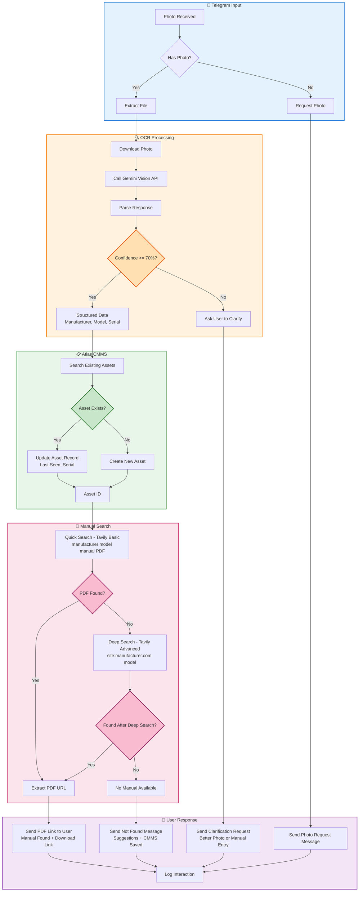

# RIVET Pro Workflow Architecture

## Main Flow: Photo → CMMS → Manual Search



## Workflow Paths

### 1. Happy Path (Best Case)
```
Photo → OCR (High Confidence) → Asset Found/Created → Quick Search → PDF Found → Send Link
Duration: ~8-12 seconds
```

### 2. Deep Search Path (Manual Not Immediately Found)
```
Photo → OCR (High Confidence) → Asset Found/Created → Quick Search → No PDF → Deep Search → Found → Send Link
Duration: ~15-25 seconds
```

### 3. Manual Not Found Path
```
Photo → OCR (High Confidence) → Asset Found/Created → Quick Search → No PDF → Deep Search → Not Found → Send Suggestions
Duration: ~20-30 seconds
```

### 4. Low Confidence Path (OCR Unclear)
```
Photo → OCR (< 70% Confidence) → Ask Clarification → User Sends Better Photo/Manual Entry
Duration: User-dependent
```

### 5. No Photo Path
```
Message without Photo → Request Photo → User Sends Photo
Duration: User-dependent
```

## Node Details

| Node | n8n Node Type | Purpose | Configuration |
|------|---------------|---------|---------------|
| Photo Received | Telegram Trigger | Listens for incoming Telegram messages | Trigger on: `message`, Filter: none (checked in next node) |
| Has Photo? | IF Node | Checks if message contains photo | Condition: `message.photo` exists |
| Request Photo | Telegram Send | Asks user to send equipment photo | Static message with instructions |
| Extract File | Telegram API | Gets file metadata from Telegram | Operation: `getFile`, File ID from photo array |
| Download Photo | HTTP Request | Downloads photo binary | GET request to Telegram file path |
| Call Gemini Vision API | HTTP Request | OCR via Gemini Vision | POST with base64 image + extraction prompt |
| Parse Response | Code (JavaScript) | Extracts structured data from Gemini | JSON parsing + regex fallback |
| Confidence >= 70%? | IF Node | Quality gate for OCR confidence | Condition: `confidence >= 70` |
| Ask User to Clarify | Telegram Send | Requests better photo or manual entry | Dynamic message showing partial data |
| Structured Data | (Flow Point) | Clean manufacturer/model/serial data | Passed to CMMS |
| Search Existing Assets | HTTP Request | Queries CMMS for existing asset | GET with manufacturer + model params |
| Asset Exists? | IF Node | Checks if asset already in CMMS | Condition: `data.length > 0` |
| Update Asset Record | HTTP Request | Updates existing asset timestamp | PATCH with last_seen, serial |
| Create New Asset | HTTP Request | Creates new asset in CMMS | POST with manufacturer, model, serial |
| Asset ID | (Flow Point) | Asset identifier for reference | Used in work order linking |
| Quick Search - Tavily | HTTP Request | Fast manual search | POST to Tavily, search_depth: `basic` |
| PDF Found? | IF Node | Checks if PDF in quick search results | Condition: results contain `.pdf` |
| Deep Search - Tavily | HTTP Request | Thorough manufacturer site search | POST to Tavily, search_depth: `advanced`, site-specific |
| Found After Deep Search? | IF Node | Checks deep search results | Condition: results contain PDF/manual/download |
| Extract PDF URL | (Flow Point) | Gets first PDF URL from results | Filters for .pdf extension |
| No Manual Available | (Flow Point) | Manual search exhausted | Trigger not found response |
| Send PDF Link | Telegram Send | Success response with download link | Markdown formatted with inline keyboard |
| Send Not Found | Telegram Send | Manual not found, provides alternatives | Suggestions for manual search |
| Send Clarification Request | Telegram Send | Asks for better OCR input | Shows partial extracted data |
| Log Interaction | (Implied) | Records user interaction | Could extend with DB logging |

## Data Flow

### Input (Telegram Message)
```json
{
  "message": {
    "chat": {"id": 123456789},
    "photo": [
      {
        "file_id": "AgACAgIAAxkBAAIC...",
        "file_size": 45678,
        "width": 1280,
        "height": 720
      }
    ]
  }
}
```

### OCR Output (Gemini Response)
```json
{
  "manufacturer": "Siemens",
  "model": "SIMATIC S7-1200",
  "serial": "6ES7 214-1AG40-0XB0",
  "errors": null,
  "confidence": 92,
  "chat_id": 123456789
}
```

### CMMS Asset
```json
{
  "id": "uuid-v4",
  "manufacturer": "Siemens",
  "model": "SIMATIC S7-1200",
  "serial": "6ES7 214-1AG40-0XB0",
  "last_seen": "2026-01-05T13:45:00Z",
  "created_via": "telegram_bot"
}
```

### Search Results (Tavily)
```json
{
  "results": [
    {
      "title": "SIMATIC S7-1200 Manual PDF",
      "url": "https://cache.industry.siemens.com/dl/files/123/456789/att_123456/v1/s71200_system_manual_en-US_en-US.pdf",
      "content": "Complete system manual for Siemens SIMATIC S7-1200..."
    }
  ]
}
```

## Performance Metrics

| Path | Expected Duration | Success Rate |
|------|------------------|--------------|
| Quick Search Success | 8-12 seconds | ~60% (common equipment) |
| Deep Search Success | 15-25 seconds | ~25% (rare equipment) |
| Manual Not Found | 20-30 seconds | ~15% |
| Low Confidence OCR | User-dependent | ~10% of photos |

## Error Handling

| Error Scenario | Handling | User Experience |
|----------------|----------|-----------------|
| Telegram API timeout | Retry 3x, then fail gracefully | "Please try again in a moment" |
| Gemini API error | Log error, ask for retry | "OCR service unavailable, please try again" |
| CMMS API down | Continue to manual search, notify | "Manual found, but CMMS unavailable - saved locally" |
| Tavily API error | Fallback to Google search | "Using alternative search method..." |
| No internet (user) | Queue for later processing | "Message received, processing when online" |

## Future Enhancements

1. **Multi-photo support**: Analyze multiple angles of same equipment
2. **Voice input**: Speak manufacturer/model instead of typing
3. **Manual caching**: Store frequently accessed PDFs in CDN
4. **Work order creation**: Auto-create WO if error code detected in photo
5. **Predictive search**: Learn from past searches to improve results
6. **Offline mode**: Download manual for offline access
7. **Translation**: Auto-translate manual to user's language
8. **AR integration**: Overlay manual instructions on live camera view

---

**Generated:** 2026-01-05
**Version:** 1.0
**Compatible with:** n8n v1.0+
