# Troubleshooting Tree Drafts

Save Claude-generated guides as draft troubleshooting trees for admin review and approval.

## Overview

The troubleshooting tree drafts system allows users to save helpful troubleshooting guides generated by Claude as draft trees. Admins can then review, approve, or reject these drafts. Approved drafts are converted into permanent troubleshooting trees that can be reused for similar problems.

## Features

- ✅ Save Claude responses as structured draft trees
- 🔍 Admin review workflow with approve/reject
- 🌳 Automatic conversion to permanent trees on approval
- 📊 Draft statistics and tracking
- 👥 Multi-user support with proper attribution
- 🔒 Admin-only approval commands

## Database Schema

### `troubleshooting_tree_drafts` Table

| Column | Type | Description |
|--------|------|-------------|
| `id` | SERIAL | Primary key |
| `equipment_type` | VARCHAR(255) | Equipment type (e.g., "Siemens S7-1200 PLC") |
| `problem` | TEXT | Problem description |
| `generated_steps` | JSONB | Array of troubleshooting steps |
| `original_query` | TEXT | Original user query context |
| `user_id` | BIGINT | Telegram ID of creator |
| `status` | VARCHAR(20) | draft, approved, or rejected |
| `approved_by` | BIGINT | Telegram ID of reviewer |
| `approved_at` | TIMESTAMPTZ | Review timestamp |
| `rejection_reason` | TEXT | Reason if rejected |
| `tree_id` | INTEGER | ID of created tree (if approved) |
| `created_at` | TIMESTAMPTZ | Creation timestamp |
| `updated_at` | TIMESTAMPTZ | Last update timestamp |

### `troubleshooting_trees` Table

| Column | Type | Description |
|--------|------|-------------|
| `id` | SERIAL | Primary key |
| `equipment_type` | VARCHAR(255) | Equipment type |
| `problem` | VARCHAR(500) | Problem description |
| `tree_data` | JSONB | Full tree structure |
| `created_by` | BIGINT | Telegram ID of creator |
| `created_at` | TIMESTAMPTZ | Creation timestamp |
| `updated_at` | TIMESTAMPTZ | Last update timestamp |
| `is_active` | BOOLEAN | Active status |
| `usage_count` | INTEGER | Times tree was used |

## Python API

### Save a Draft

```python
from rivet_pro.troubleshooting.drafts import save_draft

draft_id = await save_draft(
    equipment_type="Siemens S7-1200 PLC",
    problem="Communication fault",
    steps=[
        "Step 1: Check physical cable connections",
        "Step 2: Verify IP address configuration",
        "Step 3: Test with PING command",
        "Step 4: Check firewall settings",
        "Step 5: Verify PLC is in RUN mode"
    ],
    user_id=123456789,
    original_query="My PLC won't communicate with the HMI"
)

print(f"Draft saved with ID: {draft_id}")
```

### List Drafts

```python
from rivet_pro.troubleshooting.drafts import list_drafts, DraftStatus

# Get all pending drafts
pending_drafts = await list_drafts(status=DraftStatus.DRAFT)

# Get drafts by specific user
user_drafts = await list_drafts(user_id=123456789)

# Get approved drafts with pagination
approved_drafts = await list_drafts(
    status=DraftStatus.APPROVED,
    limit=20,
    offset=0
)

for draft in pending_drafts:
    print(f"Draft {draft['id']}: {draft['equipment_type']} - {draft['problem']}")
```

### Get Single Draft

```python
from rivet_pro.troubleshooting.drafts import get_draft

draft = await get_draft(42)

if draft:
    print(f"Equipment: {draft['equipment_type']}")
    print(f"Problem: {draft['problem']}")
    print(f"Status: {draft['status']}")
    print(f"Steps: {len(draft['generated_steps'])}")

    for i, step in enumerate(draft['generated_steps'], 1):
        print(f"  {i}. {step}")
```

### Approve Draft

```python
from rivet_pro.troubleshooting.drafts import approve_draft

tree_id = await approve_draft(
    draft_id=42,
    approved_by=987654321  # Admin user ID
)

if tree_id:
    print(f"Draft approved! Created tree ID: {tree_id}")
else:
    print("Draft not found or already processed")
```

### Reject Draft

```python
from rivet_pro.troubleshooting.drafts import reject_draft

success = await reject_draft(
    draft_id=42,
    rejected_by=987654321,  # Admin user ID
    reason="Steps are too generic, need more equipment-specific detail"
)

if success:
    print("Draft rejected successfully")
else:
    print("Draft not found or already processed")
```

### Get Statistics

```python
from rivet_pro.troubleshooting.drafts import get_draft_stats

stats = await get_draft_stats()

print(f"Total drafts: {stats['total']}")
print(f"Pending: {stats['draft']}")
print(f"Approved: {stats['approved']}")
print(f"Rejected: {stats['rejected']}")
```

## Telegram Bot Commands

### User Commands

#### `/save_guide` - Save Current Guide as Draft

Save a Claude-generated troubleshooting guide as a draft.

```
/save_guide Siemens S7-1200 PLC | Communication fault
```

Bot will prompt for troubleshooting steps. Reply with steps (one per line):
```
1. Check physical cable connections
2. Verify IP address configuration
3. Test with PING command
4. Check firewall settings
5. Verify PLC is in RUN mode
```

Bot confirms:
```
✅ Draft saved successfully!

📋 Draft ID: 42
🔧 Equipment: Siemens S7-1200 PLC
⚠️ Problem: Communication fault
📝 Steps: 5

An admin will review your draft soon.
```

### Admin Commands

#### `/drafts [status]` - List Drafts

List troubleshooting tree drafts.

```
/drafts              # List pending drafts
/drafts draft        # List pending drafts
/drafts approved     # List approved drafts
/drafts rejected     # List rejected drafts
```

Example output:
```
⏳ DRAFT DRAFTS (3)

📊 Total: 8 | ⏳ Pending: 3 | ✅ Approved: 4 | ❌ Rejected: 1

🆔 ID 42
🔧 Siemens S7-1200 PLC
⚠️ Communication fault
📝 Steps: 5
👤 By: John Smith
📅 2026-01-15 10:30

🆔 ID 41
🔧 ABB M3BP Motor
⚠️ Overheating issue
📝 Steps: 7
👤 By: Jane Doe
📅 2026-01-15 09:15
```

#### `/view_draft <id>` - View Draft Details

View detailed information about a specific draft.

```
/view_draft 42
```

Example output:
```
📋 DRAFT 42 ⏳

🔧 Equipment: Siemens S7-1200 PLC
⚠️ Problem: Communication fault
👤 Created by: John Smith
📅 Created: 2026-01-15 10:30

💬 Original Query:
My PLC won't communicate with the HMI

📝 Troubleshooting Steps:
1. Check physical cable connections
2. Verify IP address configuration
3. Test with PING command
4. Check firewall settings
5. Verify PLC is in RUN mode

[✅ Approve] [❌ Reject]
```

#### `/approve_draft <id>` - Approve Draft

Approve a draft and convert it to a permanent troubleshooting tree.

```
/approve_draft 42
```

Example output:
```
✅ Draft Approved!

📋 Draft ID: 42
🌳 Tree ID: 15

The troubleshooting tree is now available for use.
```

#### `/reject_draft <id> <reason>` - Reject Draft

Reject a draft with a reason.

```
/reject_draft 42 Steps are too generic, need more equipment-specific detail
```

Example output:
```
❌ Draft Rejected

📋 Draft ID: 42
📝 Reason: Steps are too generic, need more equipment-specific detail

The creator will be notified.
```

## Tree Structure Format

When a draft is approved, it's converted to a tree structure:

```json
{
  "version": "1.0",
  "root": "step_1",
  "nodes": [
    {
      "id": "step_1",
      "type": "action",
      "content": "Check physical cable connections",
      "actions": [
        {
          "label": "Next",
          "next": "step_2"
        }
      ]
    },
    {
      "id": "step_2",
      "type": "action",
      "content": "Verify IP address configuration",
      "actions": [
        {
          "label": "Next",
          "next": "step_3"
        }
      ]
    }
  ],
  "metadata": {
    "source": "claude_draft",
    "draft_id": 42,
    "created_from_query": "My PLC won't communicate"
  }
}
```

## Workflow

### 1. User Creates Draft


### 2. Admin Reviews Draft


### 3. Admin Approves Draft

```mermaid
sequenceDiagram
    Admin->>Bot: /approve_draft 42
    Bot->>Database: approve_draft(42, admin_id)
    Database->>Database: Create troubleshooting_tree
    Database->>Database: Update draft status
    Database-->>Bot: tree_id
    Bot->>Admin: ✅ Approved! Tree ID: 15
    Bot->>User: 🔔 Your draft was approved!
```



### 4. Admin Rejects Draft

```mermaid
sequenceDiagram
    Admin->>Bot: /reject_draft 42 Too generic
    Bot->>Database: reject_draft(42, admin_id, reason)
    Database->>Database: Update draft status
    Database-->>Bot: success
    Bot->>Admin: ❌ Draft rejected
    Bot->>User: 🔔 Draft rejected: Too generic
```



## Error Handling

All functions include comprehensive error handling:

```python
try:
    draft_id = await save_draft(...)
except ValueError as e:
    # Validation error (e.g., empty steps, missing required fields)
    print(f"Validation error: {e}")
except Exception as e:
    # Database or other errors
    print(f"Error saving draft: {e}")
```

## Testing

Run the comprehensive test suite:

```bash
cd /c/Users/hharp/OneDrive/Desktop/Rivet-PRO
python -m pytest rivet_pro/troubleshooting/test_drafts.py -v
```

Test coverage:
- ✅ Draft creation with validation
- ✅ Draft retrieval and listing
- ✅ Approval workflow
- ✅ Rejection workflow
- ✅ Draft deletion
- ✅ Statistics calculation
- ✅ Edge cases (special characters, long content)
- ✅ Concurrent operations

## Migration

Run the database migration to create tables:

```bash
cd /c/Users/hharp/OneDrive/Desktop/Rivet-PRO
python run_migrations.py
```

This will execute `migrations/023_troubleshooting_tree_drafts.sql`.

## Integration with Bot

Add commands to your bot initialization:

```python
from rivet_pro.troubleshooting.commands import (
    save_guide_command,
    list_drafts_command,
    view_draft_command,
    approve_draft_command,
    reject_draft_command,
    handle_approve_callback,
    handle_reject_callback,
)

# User commands
application.add_handler(CommandHandler("save_guide", save_guide_command))

# Admin commands
application.add_handler(CommandHandler("drafts", list_drafts_command))
application.add_handler(CommandHandler("view_draft", view_draft_command))
application.add_handler(CommandHandler("approve_draft", approve_draft_command))
application.add_handler(CommandHandler("reject_draft", reject_draft_command))

# Callback handlers for inline buttons
application.add_handler(CallbackQueryHandler(
    handle_approve_callback,
    pattern=r"^approve_draft_\d+$"
))
application.add_handler(CallbackQueryHandler(
    handle_reject_callback,
    pattern=r"^reject_draft_\d+$"
))
```

## Configuration

Add admin user IDs to `commands.py`:

```python
# Admin user IDs (should come from config)
ADMIN_USER_IDS = [
    8445149012,  # Your admin Telegram ID
    # Add more admin IDs here
]
```

## Future Enhancements

Potential improvements for future versions:

1. **Auto-suggest drafts**: When user asks similar question, suggest existing approved trees
2. **Draft editing**: Allow users to edit their draft before admin review
3. **Collaborative editing**: Multiple users can contribute to draft
4. **Version control**: Track changes to approved trees
5. **Draft templates**: Pre-populate common equipment types
6. **Analytics**: Track which drafts get approved/rejected and why
7. **User notifications**: Alert users when their draft is reviewed
8. **Batch operations**: Approve/reject multiple drafts at once
9. **Export/import**: Share trees between installations
10. **AI-assisted review**: Claude helps admins review drafts

## License

Part of RIVET Pro - Atlas CMMS System
